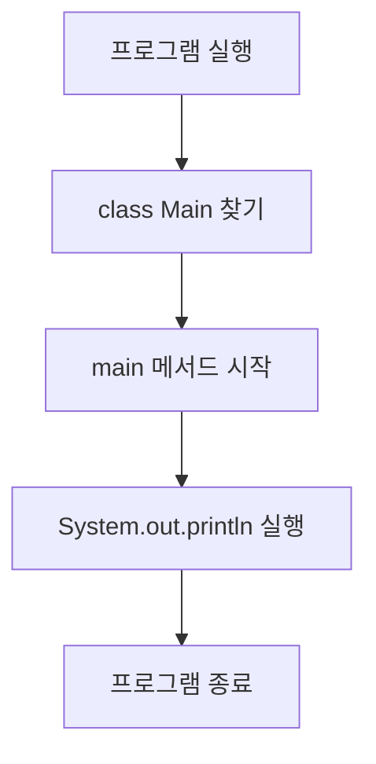
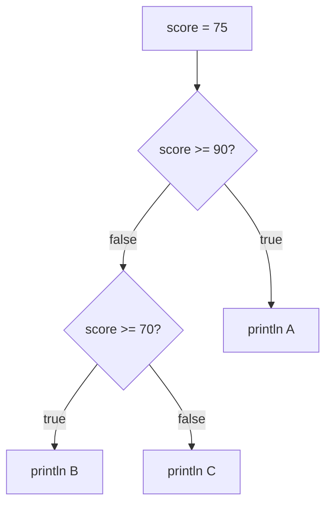

# 3주차 1일차 - Java 기본 구조, 변수, 조건문, 반복문, 배열

## 오늘의 목표

오늘은 Java 코드를 처음 보는 사람이 시험장에서 당황하지 않도록 기본 실행 흐름을 잡는다.

- `main` 메서드가 왜 시작점인지 설명할 수 있다.
- 변수의 값이 바뀌는 순서를 표로 추적할 수 있다.
- `if`, `for`, `while`, 배열 코드의 출력 결과를 손으로 예측할 수 있다.
- C 언어와 Java의 비슷한 점과 다른 점을 구분할 수 있다.
- `System.out.println` 로그를 넣어 실행 흐름을 검증할 수 있다.

** main stack, static stack, heap stack, custom stack 과 class의 영역은 사람이 직접 설명한다 **

## 3시간 수업 구성

| 시간        | 내용                                |
| ----------- | ----------------------------------- |
| 0:00 ~ 0:20 | Java 코드의 전체 모양과 실행 시작점 |
| 0:20 ~ 0:50 | 변수, 자료형, 대입, 산술 연산       |
| 0:50 ~ 1:20 | 조건문과 반복문의 손추적            |
| 1:20 ~ 1:30 | 쉬는 시간                           |
| 1:30 ~ 2:10 | 배열과 인덱스 추적                  |
| 2:10 ~ 2:40 | 실기형 코드 읽기 실습               |
| 2:40 ~ 3:00 | 변형 문제와 오늘의 점검             |

---

## 1. Java 프로그램의 가장 기본 모양

Java 프로그램은 보통 `class` 안에 코드를 넣는다. 정보처리기사 실기에서는 긴 프로그램보다 짧은 코드의 출력 결과를 묻는 문제가 자주 나온다.

```java
class Main {
    public static void main(String[] args) {
        System.out.println("Hello Java");
    }
}
```

### 실행 흐름 그림



처음에는 `public`, `static`, `void`, `String[] args`를 모두 완벽히 외우려 하지 않아도 된다. 시험 코드 추적에서는 다음처럼 생각하면 충분하다.

| 부분                      | 지금 단계의 의미       |
| ------------------------- | ---------------------- |
| `class Main`              | 코드를 담는 상자       |
| `main`                    | 실행이 시작되는 지점   |
| `{ }`                     | 실행할 코드의 범위     |
| `System.out.println(...)` | 화면에 출력하고 줄바꿈 |

### C와 비교

| C 언어                                | Java                                     |
| ------------------------------------- | ---------------------------------------- |
| `printf("%d", a);`                    | `System.out.println(a);`                 |
| `int main()`                          | `public static void main(String[] args)` |
| 함수 중심으로 시작                    | 클래스 안의 메서드로 시작                |
| 직접 메모리 주소를 다루는 포인터 있음 | 주소를 직접 계산하는 포인터 문법은 없음  |

Java에는 C처럼 `int *p`, `&a`, `*p` 같은 문법은 없다. 하지만 객체와 배열은 내부적으로 “어딘가에 있는 실제 데이터”를 참조한다. 즉, 참조 개념은 남아 있고 직접 주소를 만지는 문법만 사라졌다고 이해해야 한다.

---

## 2. 변수와 대입

변수는 값을 담는 이름표다.

```java
class Main {
    public static void main(String[] args) {
        int a = 10;
        int b = 3;
        int c = a + b;

        System.out.println(c);
    }
}
```

출력:

```text
13
```

### 변수 상태표

| 줄  | 실행 내용        |   a |   b |   c |
| --- | ---------------- | --: | --: | --: |
| 3   | `int a = 10;`    |  10 |   - |   - |
| 4   | `int b = 3;`     |  10 |   3 |   - |
| 5   | `int c = a + b;` |  10 |   3 |  13 |
| 7   | `println(c)`     |  10 |   3 |  13 |

시험장에서 코드를 볼 때 머리로만 계산하면 금방 꼬인다. 반드시 이런 식으로 줄마다 값이 어떻게 변하는지 표를 만든다.

### 대입은 오른쪽을 먼저 계산한다

```java
int x = 5;
x = x + 2;
System.out.println(x);
```

`x = x + 2`는 다음 순서로 실행된다.

```text
1. 오른쪽 x + 2 계산: 5 + 2 = 7
2. 왼쪽 x에 7 저장
3. 기존 5는 사라짐
```

출력:

```text
7
```

---

## 3. 자료형과 연산

정보처리기사 실기 코드에서 자주 보이는 기본 자료형은 다음 정도다.

| 자료형    | 의미     | 예              |
| --------- | -------- | --------------- |
| `int`     | 정수     | `10`, `-3`      |
| `double`  | 실수     | `3.14`          |
| `char`    | 문자 1개 | `'A'`           |
| `boolean` | 참/거짓  | `true`, `false` |
| `String`  | 문자열   | `"Java"`        |

### 정수 나눗셈

```java
int a = 7;
int b = 2;

System.out.println(a / b);
System.out.println(a % b);
```

출력:

```text
3
1
```

`int / int`는 소수점 아래를 버린다. `7 / 2`는 `3.5`가 아니라 `3`이다. `%`는 나머지다.

### 증가 연산자

```java
int a = 5;
int b = ++a;
int c = a++;

System.out.println(a);
System.out.println(b);
System.out.println(c);
```

상태표:

| 줄  | 실행 내용      |   a |   b |   c |
| --- | -------------- | --: | --: | --: |
| 1   | `int a = 5;`   |   5 |   - |   - |
| 2   | `int b = ++a;` |   6 |   6 |   - |
| 3   | `int c = a++;` |   7 |   6 |   6 |

출력:

```text
7
6
6
```

핵심은 다음이다.

| 문법  | 의미                      |
| ----- | ------------------------- |
| `++a` | 먼저 1 증가, 그 다음 사용 |
| `a++` | 먼저 사용, 그 다음 1 증가 |

---

## 4. 조건문 추적

```java
int score = 75;

if (score >= 90) {
    System.out.println("A");
} else if (score >= 70) {
    System.out.println("B");
} else {
    System.out.println("C");
}
```

조건은 위에서 아래로 검사한다.



출력:

```text
B
```

`score >= 70`이 참이므로 `"B"`가 출력된다. 이미 실행된 `else if` 아래의 `else`는 실행하지 않는다.

---

## 5. 반복문 손추적

```java
int sum = 0;

for (int i = 1; i <= 4; i++) {
    sum += i;
}

System.out.println(sum);
```

### 반복문 상태표

|     반복 |   i | 조건 `i <= 4` | 실행 후 sum |
| -------: | --: | ------------- | ----------: |
|     시작 |   1 | true          |           1 |
|      2회 |   2 | true          |           3 |
|      3회 |   3 | true          |           6 |
|      4회 |   4 | true          |          10 |
| 종료검사 |   5 | false         |          10 |

출력:

```text
10
```

### for문의 실행 순서

```text
for (초기식; 조건식; 증감식) {
    본문
}
```

실행 순서:

```text
초기식 -> 조건식 -> 본문 -> 증감식 -> 조건식 -> 본문 -> 증감식 ...
```

초기식은 처음 한 번만 실행된다.

---

## 6. 배열과 인덱스

배열은 같은 종류의 값을 여러 개 묶어 놓은 구조다.

```java
int[] arr = {3, 5, 2, 4};

System.out.println(arr[0]);
System.out.println(arr[2]);
```

배열 그림:

```text
인덱스:   0   1   2   3
값:      3   5   2   4
```

출력:

```text
3
2
```

배열 인덱스는 0부터 시작한다.

### 배열 반복

```java
int[] arr = {3, 5, 2, 4};
int sum = 0;

for (int i = 0; i < arr.length; i++) {
    sum += arr[i];
}

System.out.println(sum);
```

상태표:

| 반복 |   i | arr[i] | sum |
| ---: | --: | -----: | --: |
|    1 |   0 |      3 |   3 |
|    2 |   1 |      5 |   8 |
|    3 |   2 |      2 |  10 |
|    4 |   3 |      4 |  14 |
| 종료 |   4 |      - |  14 |

출력:

```text
14
```

`arr.length`는 배열의 길이다. 위 배열은 값이 4개이므로 `arr.length`는 4다. 마지막 인덱스는 `3`이다.

---

## 7. 로그로 실행 흐름 검증하기

시험 준비에서는 정답을 외우는 것보다 흐름을 확인하는 습관이 중요하다.

```java
int[] arr = {2, 4, 6};
int total = 0;

for (int i = 0; i < arr.length; i++) {
    total += arr[i];
    System.out.println("i=" + i + ", arr[i]=" + arr[i] + ", total=" + total);
}
```

출력:

```text
i=0, arr[i]=2, total=2
i=1, arr[i]=4, total=6
i=2, arr[i]=6, total=12
```

`+`는 숫자끼리 있으면 덧셈이고, 문자열이 섞이면 이어 붙이기다.

---

## 8. 실전 실기형 예제 1

다음 코드의 출력 결과를 쓰시오.

```java
class Main {
    public static void main(String[] args) {
        int a = 3;
        int b = 5;

        a = a + b;
        b = a - b;
        a = a - b;

        System.out.println(a);
        System.out.println(b);
    }
}
```

### 손추적

| 줄           |   a |   b | 설명     |
| ------------ | --: | --: | -------- |
| `int a = 3;` |   3 |   - | a 초기화 |
| `int b = 5;` |   3 |   5 | b 초기화 |
| `a = a + b;` |   8 |   5 | 3 + 5    |
| `b = a - b;` |   8 |   3 | 8 - 5    |
| `a = a - b;` |   5 |   3 | 8 - 3    |

정답:

```text
5
3
```

두 변수의 값을 바꾸는 코드다. 임시 변수 없이 계산으로 교환했다.

---

## 9. 실전 실기형 예제 2

다음 코드의 출력 결과를 쓰시오.

```java
class Main {
    public static void main(String[] args) {
        int[] data = {4, 1, 3, 2};
        int result = 0;

        for (int i = 0; i < data.length; i++) {
            if (data[i] % 2 == 0) {
                result += data[i];
            } else {
                result -= data[i];
            }
        }

        System.out.println(result);
    }
}
```

상태표:

|   i | data[i] | 짝수? | result 변화 |
| --: | ------: | ----- | ----------: |
|   0 |       4 | true  |   0 + 4 = 4 |
|   1 |       1 | false |   4 - 1 = 3 |
|   2 |       3 | false |   3 - 3 = 0 |
|   3 |       2 | true  |   0 + 2 = 2 |

정답:

```text
2
```

---

## 10. 오늘의 혼자 연습 문제

### 문제 1

다음 코드의 출력 결과를 쓰시오.

```java
class Main {
    public static void main(String[] args) {
        int x = 10;
        int y = 4;

        System.out.println(x / y);
        System.out.println(x % y);
        System.out.println(x + y * 2);
    }
}
```

### 문제 2

다음 코드의 출력 결과를 쓰시오.

```java
class Main {
    public static void main(String[] args) {
        int n = 1;

        for (int i = 1; i <= 4; i++) {
            n *= i;
        }

        System.out.println(n);
    }
}
```

### 문제 3

다음 코드의 출력 결과를 쓰시오.

```java
class Main {
    public static void main(String[] args) {
        int[] a = {5, 2, 7, 1};
        int max = a[0];

        for (int i = 1; i < a.length; i++) {
            if (a[i] > max) {
                max = a[i];
            }
        }

        System.out.println(max);
    }
}
```

### 문제 4

다음 코드에서 `i <= 3`을 `i < 3`으로 바꾸면 출력이 어떻게 달라지는지 설명하시오.

```java
class Main {
    public static void main(String[] args) {
        int sum = 0;

        for (int i = 1; i <= 3; i++) {
            sum += i * 2;
        }

        System.out.println(sum);
    }
}
```

### 문제 5

배열 `{2, 4, 1, 3}`에서 홀수만 더하는 코드를 작성하시오. 출력 결과는 `4`가 되어야 한다.

---

## 11. 정답과 해설

### 문제 1 정답

```text
2
2
18
```

`10 / 4`는 정수 나눗셈이라 `2`, `10 % 4`는 `2`다. 곱셈이 덧셈보다 먼저라 `10 + 4 * 2 = 18`이다.

### 문제 2 정답

```text
24
```

상태표:

|   i |   n |
| --: | --: |
|   1 |   1 |
|   2 |   2 |
|   3 |   6 |
|   4 |  24 |

### 문제 3 정답

```text
7
```

`max`는 처음에 `5`이고, `7`을 만났을 때만 갱신된다.

### 문제 4 정답

원래 코드:

```text
i = 1, 2, 3 실행
sum = 2 + 4 + 6 = 12
```

변경 코드:

```text
i = 1, 2 실행
sum = 2 + 4 = 6
```

### 문제 5 예시 정답

```java
class Main {
    public static void main(String[] args) {
        int[] arr = {2, 4, 1, 3};
        int sum = 0;

        for (int i = 0; i < arr.length; i++) {
            if (arr[i] % 2 == 1) {
                sum += arr[i];
            }
        }

        System.out.println(sum);
    }
}
```

---

## 오늘의 마무리 체크

- Java 프로그램은 `main`에서 시작한다.
- 대입은 오른쪽 계산 후 왼쪽 저장이다.
- 정수 나눗셈은 소수점을 버린다.
- 배열 인덱스는 0부터 시작한다.
- 반복문은 상태표로 추적해야 실수가 줄어든다.
- Java에는 C식 포인터 문법은 없지만, 배열과 객체는 참조 개념으로 동작한다.
