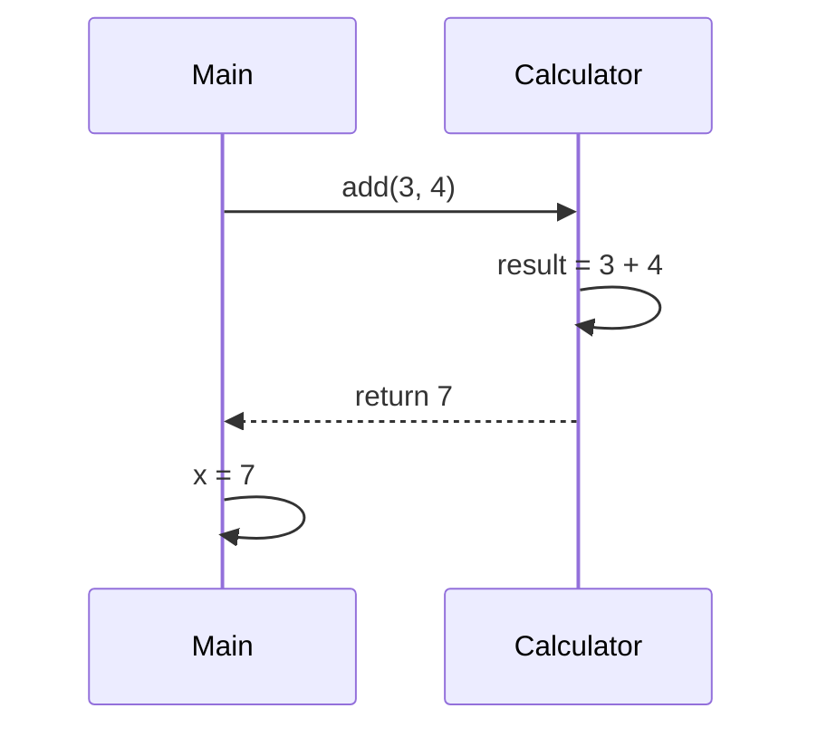

# 3주차 2일차 - 클래스, 객체, 메서드, 참조

## 오늘의 목표

오늘은 Java의 핵심인 객체를 다룬다. 정보처리기사 실기 Java 문제는 객체가 생성되고, 메서드가 호출되고, 필드 값이 바뀌는 흐름을 묻는 경우가 많다.

- 클래스와 객체의 차이를 설명할 수 있다.
- 필드와 지역 변수를 구분할 수 있다.
- 메서드 호출 시 매개변수와 반환값의 흐름을 추적할 수 있다.
- 객체 참조가 C 포인터와 어떤 점에서 비슷하고 다른지 이해할 수 있다.
- 같은 객체를 두 변수가 가리키는 상황을 손으로 그릴 수 있다.

/_ 객체가 포인터라는건 사람이 직접 설명한다. _/

## 3시간 수업 구성

| 시간        | 내용                      |
| ----------- | ------------------------- |
| 0:00 ~ 0:25 | 클래스와 객체의 기본 개념 |
| 0:25 ~ 0:55 | 필드, 지역 변수, 메서드   |
| 0:55 ~ 1:20 | 메서드 호출과 return 추적 |
| 1:20 ~ 1:30 | 쉬는 시간                 |
| 1:30 ~ 2:10 | 객체 참조와 C 포인터 비교 |
| 2:10 ~ 2:40 | 실기형 객체 추적 문제     |
| 2:40 ~ 3:00 | 연습 문제 풀이            |

---

## 1. 클래스와 객체

클래스는 설계도, 객체는 설계도로 만든 실제 물건이다.

```java
class Student {
    String name;
    int score;
}

class Main {
    public static void main(String[] args) {
        Student s = new Student();
        s.name = "Kim";
        s.score = 80;

        System.out.println(s.name);
        System.out.println(s.score);
    }
}
```

출력:

```text
Kim
80
```

### 그림으로 보기

```text
Student 클래스
+----------------+
| name           |
| score          |
+----------------+
        |
        | new Student()
        v

s ----> Student 객체
       +----------------+
       | name  = "Kim"  |
       | score = 80     |
       +----------------+
```

`Student s`는 객체 자체가 아니라 객체를 가리키는 참조 변수다. 이 점이 중요하다.

---

## 2. 필드와 지역 변수

```java
class Box {
    int value; // 필드

    void setValue(int n) {
        int temp = n * 2; // 지역 변수
        value = temp;
    }
}
```

| 종류      | 위치                 | 살아 있는 범위        |
| --------- | -------------------- | --------------------- |
| 필드      | 클래스 안, 메서드 밖 | 객체가 살아 있는 동안 |
| 지역 변수 | 메서드 안            | 메서드 실행 중        |
| 매개변수  | 메서드 괄호 안       | 메서드 실행 중        |

예제:

```java
class Box {
    int value = 10;

    void change(int value) {
        value = value + 5;
    }
}

class Main {
    public static void main(String[] args) {
        Box b = new Box();
        b.change(20);
        System.out.println(b.value);
    }
}
```

출력:

```text
10
```

왜 `15`나 `25`가 아닐까?

`change` 메서드의 `value`는 매개변수다. 필드 `value`와 이름은 같지만 다른 변수다.

```text
b 객체의 필드 value = 10

change(20) 호출
메서드 안 매개변수 value = 20
value = value + 5 -> 매개변수 value만 25

메서드 종료
매개변수 value 사라짐
b.value는 여전히 10
```

필드에 접근하려면 내일 배울 `this.value`를 쓰는 편이 명확하다.

---

## 3. 메서드 호출과 return

```java
class Calculator {
    int add(int a, int b) {
        int result = a + b;
        return result;
    }
}

class Main {
    public static void main(String[] args) {
        Calculator c = new Calculator();
        int x = c.add(3, 4);
        System.out.println(x);
    }
}
```

흐름:



출력:

```text
7
```

### return은 값을 돌려주고 메서드를 끝낸다

```java
class Test {
    int f(int n) {
        if (n > 0) {
            return n * 2;
        }
        return n - 2;
    }
}
```

`n`이 3이면 첫 번째 `return`에서 메서드가 끝난다. 아래 `return n - 2`는 실행하지 않는다.

---

## 4. 객체 참조와 C 포인터

Java를 배울 때 “Java에는 포인터가 없다”고만 외우면 위험하다. 정확히는 이렇다.

> Java에는 C처럼 주소를 직접 보고 계산하는 포인터 문법이 없다. 하지만 객체 변수는 객체를 직접 담는 것이 아니라 객체를 참조한다.

### C 포인터 느낌

```c
int a = 10;
int *p = &a;
*p = 20;
```

`p`는 `a`의 주소를 담고, `*p`로 실제 값을 바꿀 수 있다.

### Java 참조 느낌

```java
class Box {
    int value;
}

class Main {
    public static void main(String[] args) {
        Box b1 = new Box();
        Box b2 = b1;

        b1.value = 10;
        b2.value = 20;

        System.out.println(b1.value);
    }
}
```

출력:

```text
20
```

그림:

```text
b1 ----\
       >---- Box 객체
b2 ----/     +------------+
             | value = 20 |
             +------------+
```

`b2 = b1`은 객체를 복사한 것이 아니다. 같은 객체를 같이 가리키게 만든 것이다. 그래서 `b2.value = 20`을 하면 `b1.value`로 봐도 20이다.

### C 포인터와 Java 참조 비교

| 구분                           | C 포인터            | Java 참조           |
| ------------------------------ | ------------------- | ------------------- |
| 주소 직접 확인                 | 가능                | 불가능              |
| 주소 연산                      | 가능                | 불가능              |
| 같은 대상을 여러 변수가 가리킴 | 가능                | 가능                |
| 잘못된 주소 접근               | 가능해서 위험       | JVM이 막아줌        |
| 시험에서 중요한 점             | `*`, `&`, 주소 흐름 | 같은 객체 공유 여부 |

---

## 5. 기본형은 값이 복사된다

```java
class Main {
    public static void main(String[] args) {
        int a = 10;
        int b = a;

        b = 20;

        System.out.println(a);
        System.out.println(b);
    }
}
```

출력:

```text
10
20
```

그림:

```text
a [10]
b [20]
```

`int`, `double`, `char`, `boolean` 같은 기본형은 값 자체가 복사된다.

---

## 6. 객체는 참조가 복사된다

```java
class Score {
    int value;
}

class Main {
    public static void main(String[] args) {
        Score s1 = new Score();
        s1.value = 70;

        Score s2 = s1;
        s2.value = 90;

        System.out.println(s1.value);
        System.out.println(s2.value);
    }
}
```

출력:

```text
90
90
```

그림:

```text
s1 ----\
       >---- Score 객체
s2 ----/     +------------+
             | value = 90 |
             +------------+
```

시험에서 객체 문제는 “새 객체가 만들어졌는가?”와 “같은 객체를 가리키는가?”를 구분하면 절반은 풀린다.

---

## 7. 메서드에 기본형을 넘기는 경우

```java
class Test {
    void change(int n) {
        n = 100;
    }
}

class Main {
    public static void main(String[] args) {
        int x = 10;
        Test t = new Test();
        t.change(x);
        System.out.println(x);
    }
}
```

출력:

```text
10
```

`change(x)`를 호출하면 `x`의 값 10이 매개변수 `n`으로 복사된다. `n`을 100으로 바꿔도 원래 `x`는 바뀌지 않는다.

```text
main의 x [10]

change 호출 시
n [10]  <- x 값 복사
n [100] <- n만 변경

메서드 종료 후 n 사라짐
x는 여전히 10
```

---

## 8. 메서드에 객체를 넘기는 경우

```java
class Box {
    int value;
}

class Test {
    void change(Box b) {
        b.value = 100;
    }
}

class Main {
    public static void main(String[] args) {
        Box box = new Box();
        box.value = 10;

        Test t = new Test();
        t.change(box);

        System.out.println(box.value);
    }
}
```

출력:

```text
100
```

객체를 넘길 때는 참조값이 복사된다. 매개변수 `b`와 main의 `box`는 같은 객체를 가리킨다.

```text
box ----\
        >---- Box 객체
b   ----/     +-------------+
              | value = 100 |
              +-------------+
```

주의할 점:

```java
void change(Box b) {
    b = new Box();
    b.value = 100;
}
```

이 경우에는 main의 원래 객체가 바뀌지 않는다. `b`가 새로운 객체를 가리키도록 바뀐 것뿐이다.

---

## 9. 실전 실기형 예제 1

다음 코드의 출력 결과를 쓰시오.

```java
class Box {
    int value;
}

class Main {
    public static void main(String[] args) {
        Box a = new Box();
        Box b = new Box();

        a.value = 5;
        b.value = 7;

        a = b;
        a.value = 10;

        System.out.println(b.value);
    }
}
```

### 해설

처음:

```text
a --> Box1 value = 5
b --> Box2 value = 7
```

`a = b` 실행 후:

```text
a ----\
      >---- Box2 value = 7
b ----/

Box1 value = 5  (더 이상 a가 가리키지 않음)
```

`a.value = 10` 실행 후:

```text
a ----\
      >---- Box2 value = 10
b ----/
```

정답:

```text
10
```

---

## 10. 실전 실기형 예제 2

다음 코드의 출력 결과를 쓰시오.

```java
class Counter {
    int count;

    void up() {
        count++;
    }
}

class Main {
    public static void main(String[] args) {
        Counter c1 = new Counter();
        Counter c2 = c1;

        c1.up();
        c2.up();
        c1.up();

        System.out.println(c1.count);
        System.out.println(c2.count);
    }
}
```

정답:

```text
3
3
```

`c1`과 `c2`는 같은 `Counter` 객체를 가리킨다.

---

## 11. 오늘의 혼자 연습 문제

### 문제 1

다음 코드의 출력 결과를 쓰시오.

```java
class Item {
    int price;
}

class Main {
    public static void main(String[] args) {
        Item i1 = new Item();
        Item i2 = i1;

        i1.price = 100;
        i2.price += 50;

        System.out.println(i1.price);
    }
}
```

### 문제 2

다음 코드의 출력 결과를 쓰시오.

```java
class Test {
    int calc(int a, int b) {
        a = a + 2;
        b = b * 3;
        return a + b;
    }
}

class Main {
    public static void main(String[] args) {
        Test t = new Test();
        int result = t.calc(2, 4);
        System.out.println(result);
    }
}
```

### 문제 3

다음 코드의 출력 결과를 쓰시오.

```java
class Box {
    int n;
}

class Test {
    void change(Box b) {
        b.n = b.n + 10;
    }
}

class Main {
    public static void main(String[] args) {
        Box box = new Box();
        box.n = 5;

        Test t = new Test();
        t.change(box);

        System.out.println(box.n);
    }
}
```

### 문제 4

다음 코드의 출력 결과를 쓰시오.

```java
class Box {
    int n;
}

class Test {
    void change(Box b) {
        b = new Box();
        b.n = 99;
    }
}

class Main {
    public static void main(String[] args) {
        Box box = new Box();
        box.n = 5;

        Test t = new Test();
        t.change(box);

        System.out.println(box.n);
    }
}
```

### 문제 5

`Student` 클래스를 만들고 이름과 점수를 저장한 뒤, 점수가 60 이상이면 `"PASS"`, 아니면 `"FAIL"`을 출력하는 코드를 작성하시오.

---

## 12. 정답과 해설

### 문제 1 정답

```text
150
```

`i1`과 `i2`는 같은 객체를 가리킨다.

### 문제 2 정답

```text
16
```

`a = 2 + 2 = 4`, `b = 4 * 3 = 12`, 반환값은 `16`이다.

### 문제 3 정답

```text
15
```

객체 참조가 매개변수로 복사되므로 같은 객체의 필드 `n`이 바뀐다.

### 문제 4 정답

```text
5
```

매개변수 `b`가 새 객체를 가리키게 되었을 뿐, main의 `box`가 가리키던 객체는 그대로다.

### 문제 5 예시 정답

```java
class Student {
    String name;
    int score;
}

class Main {
    public static void main(String[] args) {
        Student s = new Student();
        s.name = "Kim";
        s.score = 75;

        if (s.score >= 60) {
            System.out.println("PASS");
        } else {
            System.out.println("FAIL");
        }
    }
}
```

---

## 오늘의 마무리 체크

- 클래스는 설계도, 객체는 실제 데이터 덩어리다.
- `new`가 나오면 새 객체가 만들어진다.
- 기본형 변수는 값이 복사된다.
- 객체 변수는 참조값이 복사된다.
- Java에는 C식 포인터 문법이 없지만, 같은 객체를 여러 변수가 참조할 수 있다.
- 객체 문제는 그림을 그리면 훨씬 쉬워진다.
