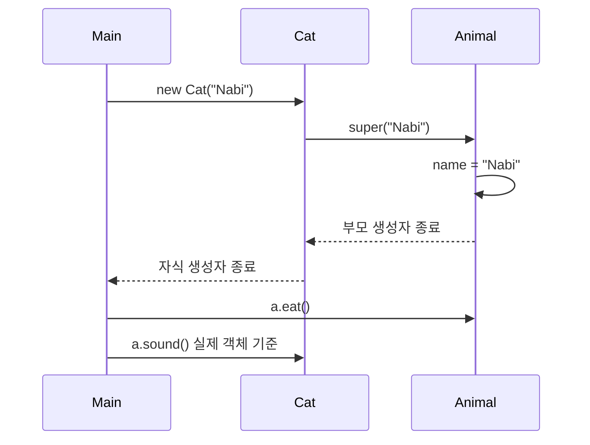

# 3주차 6일차 - 추상 클래스 abstract와 다형성 실전

## 오늘의 목표

오늘은 상속과 다형성을 한 단계 확장한다. `abstract class`는 객체를 바로 만들기 위한 클래스가 아니라, 자식 클래스들이 공통으로 가져야 할 필드와 메서드의 기준을 만드는 클래스다.

- 추상 클래스와 일반 클래스의 차이를 설명할 수 있다.
- 추상 메서드가 왜 필요한지 이해한다.
- 자식 클래스가 추상 메서드를 반드시 구현해야 하는 이유를 설명할 수 있다.
- 부모 타입 배열에서 서로 다른 자식 객체의 오버라이딩 메서드를 추적할 수 있다.
- `abstract`, 생성자, `super`, 다형성이 함께 나오는 실기형 코드를 풀 수 있다.

## 선수 지식

이 파일을 보기 전에 다음 내용을 복습한다.

```text
extends       : 부모 클래스를 상속한다.
super(...)    : 부모 생성자를 호출한다.
오버라이딩    : 부모 메서드를 자식이 다시 정의한다.
다형성        : 부모 타입 변수로 자식 객체를 참조한다.
```

## 3시간 수업 구성

| 시간 | 내용 |
|---|---|
| 0:00 ~ 0:25 | 추상화와 추상 클래스의 필요성 |
| 0:25 ~ 0:55 | `abstract class`, 추상 메서드 문법 |
| 0:55 ~ 1:20 | 생성자, 일반 메서드, 필드와 함께 사용 |
| 1:20 ~ 1:30 | 쉬는 시간 |
| 1:30 ~ 2:00 | 부모 타입 배열과 다형성 |
| 2:00 ~ 2:35 | 실기형 코드 추적 |
| 2:35 ~ 3:00 | 혼자 연습 문제와 오답 점검 |

---

## 1. 추상화란 무엇인가

추상화는 여러 대상의 공통점을 뽑아 기준을 만드는 것이다.

```text
강아지: 소리를 낸다, 먹는다
고양이: 소리를 낸다, 먹는다
새    : 소리를 낸다, 먹는다

공통점: 동물은 소리를 내고 먹는다.
```

그런데 모든 동물의 울음소리가 같지는 않다.

```text
먹는다     -> 공통 동작을 미리 작성할 수 있음
소리를 낸다 -> 동물마다 달라서 자식이 직접 작성해야 함
```

이때 사용하는 것이 추상 클래스와 추상 메서드다.

---

## 2. abstract class 기본 문법

`abstract class`는 추상 클래스다. 추상 클래스는 `new`로 직접 객체를 만들 수 없다.

```java
abstract class Animal {
    abstract void sound();
}

class Dog extends Animal {
    void sound() {
        System.out.println("Dog");
    }
}

class Main {
    public static void main(String[] args) {
        // Animal a = new Animal(); // 컴파일 오류
        Animal a = new Dog();
        a.sound();
    }
}
```

출력:

```text
Dog
```

### 핵심 구조

```text
abstract class Animal
        |
        | sound()를 반드시 구현하라는 기준
        v
      class Dog
        |
        | void sound() { ... }
        v
      "Dog" 출력
```

`Animal` 객체를 바로 만들 수는 없지만 `Animal` 타입 변수는 만들 수 있다. 그 변수는 완성된 자식 객체를 가리킬 수 있다.

---

## 3. 추상 메서드

추상 메서드는 선언만 있고 본문이 없는 메서드다.

```java
abstract void sound();
```

중괄호 `{}`가 없고 세미콜론 `;`으로 끝난다.

| 구분 | 코드 | 의미 |
|---|---|---|
| 일반 메서드 | `void eat() { ... }` | 실행할 내용이 이미 있음 |
| 추상 메서드 | `abstract void sound();` | 자식이 실행 내용을 작성해야 함 |

추상 메서드를 가진 클래스는 반드시 추상 클래스여야 한다.

```java
// 오류: 일반 클래스에 추상 메서드를 둘 수 없다.
class Animal {
    abstract void sound();
}
```

올바른 형태:

```java
abstract class Animal {
    abstract void sound();
}
```

---

## 4. 자식 클래스의 의무

추상 클래스를 상속받은 일반 자식 클래스는 추상 메서드를 반드시 구현해야 한다.

```java
abstract class Animal {
    abstract void sound();
}

// 오류: sound()를 구현하지 않았다.
class Dog extends Animal {
}
```

올바른 형태:

```java
class Dog extends Animal {
    void sound() {
        System.out.println("멍멍");
    }
}
```

단, 자식 클래스도 `abstract`라면 구현을 다음 자식에게 미룰 수 있다.

```java
abstract class Animal {
    abstract void sound();
}

abstract class Pet extends Animal {
}

class Dog extends Pet {
    void sound() {
        System.out.println("Dog");
    }
}
```

그림:

```text
Animal: sound() 구현 필요
   |
   v
Pet: 아직 구현하지 않고 다음 자식에게 미룸
   |
   v
Dog: sound() 구현 완료
```

---

## 5. 추상 클래스도 필드, 생성자, 일반 메서드를 가진다

추상 클래스는 불완전한 클래스지만, 아무것도 할 수 없는 클래스는 아니다. 공통 필드, 생성자, 일반 메서드를 가질 수 있다.

```java
abstract class Animal {
    String name;

    Animal(String name) {
        this.name = name;
        System.out.println("Animal 생성자");
    }

    void eat() {
        System.out.println(name + ":eat");
    }

    abstract void sound();
}

class Cat extends Animal {
    Cat(String name) {
        super(name);
        System.out.println("Cat 생성자");
    }

    void sound() {
        System.out.println(name + ":meow");
    }
}

class Main {
    public static void main(String[] args) {
        Animal a = new Cat("Nabi");
        a.eat();
        a.sound();
    }
}
```

출력:

```text
Animal 생성자
Cat 생성자
Nabi:eat
Nabi:meow
```

### 생성 순서 시각화



주의: 추상 클래스의 객체를 직접 만들 수 없다는 것과 추상 클래스의 생성자가 실행되지 않는다는 것은 다른 말이다. 자식 객체를 만들 때 부모인 추상 클래스의 생성자는 실행된다.

---

## 6. 일반 클래스와 추상 클래스 비교

| 구분 | 일반 클래스 | 추상 클래스 |
|---|---|---|
| 선언 | `class A` | `abstract class A` |
| 직접 객체 생성 | 가능 | 불가능 |
| 생성자 작성 | 가능 | 가능 |
| 필드 작성 | 가능 | 가능 |
| 일반 메서드 작성 | 가능 | 가능 |
| 추상 메서드 작성 | 불가능 | 가능 |
| 주된 목적 | 완성된 객체 생성 | 공통 기능 제공과 구현 기준 설정 |

시험에서 자주 나오는 오답:

```text
오답: 추상 클래스에는 생성자가 없다.
정답: 추상 클래스도 생성자를 가질 수 있고, 자식 객체 생성 시 실행된다.

오답: 추상 클래스 타입의 변수도 만들 수 없다.
정답: 변수는 만들 수 있다. new Animal()처럼 직접 객체 생성만 할 수 없다.
```

---

## 7. 부모 타입 배열과 다형성

추상 클래스는 부모 타입 배열과 함께 사용할 때 강력하다.

```java
abstract class Shape {
    abstract int area();
}

class Rectangle extends Shape {
    int width;
    int height;

    Rectangle(int width, int height) {
        this.width = width;
        this.height = height;
    }

    int area() {
        return width * height;
    }
}

class Square extends Shape {
    int side;

    Square(int side) {
        this.side = side;
    }

    int area() {
        return side * side;
    }
}

class Main {
    public static void main(String[] args) {
        Shape[] shapes = {
            new Rectangle(3, 4),
            new Square(5),
            new Rectangle(2, 6)
        };

        int sum = 0;
        for (int i = 0; i < shapes.length; i++) {
            sum += shapes[i].area();
        }

        System.out.println(sum);
    }
}
```

출력:

```text
49
```

### 배열 그림

```text
shapes
+-----+-----+-----+
| [0] | [1] | [2] |
+--|--+--|--+--|--+
   |     |     |
   v     v     v
Rectangle Square Rectangle
  3 * 4    5 * 5   2 * 6
   12       25      12

합계: 12 + 25 + 12 = 49
```

배열 타입은 모두 `Shape`지만 실제 객체가 다르므로 각각 오버라이딩한 `area()`가 실행된다.

---

## 8. 실기 문제 추적 순서

추상 클래스가 나오면 다음 순서로 푼다.

```text
1. abstract class와 abstract 메서드에 표시한다.
2. 어떤 자식 클래스가 추상 메서드를 구현했는지 찾는다.
3. new가 있는 줄에서 실제 객체 타입을 적는다.
4. 생성자가 있으면 부모 생성자부터 순서대로 적는다.
5. 메서드 호출은 실제 객체가 오버라이딩했는지 확인한다.
6. 배열이면 인덱스별 실제 객체를 표로 만든다.
7. 출력문 순서대로 결과를 적는다.
```

---

## 9. 실전 실기형 예제 1

다음 코드의 출력 결과를 쓰시오.

```java
abstract class A {
    A() {
        System.out.print("A");
    }

    abstract void print();
}

class B extends A {
    B() {
        System.out.print("B");
    }

    void print() {
        System.out.print("C");
    }
}

class Main {
    public static void main(String[] args) {
        A obj = new B();
        obj.print();
    }
}
```

정답:

```text
ABC
```

해설:

```text
new B()
-> 부모 A 생성자
-> 자식 B 생성자
-> 실제 객체 B의 print()
```

---

## 10. 실전 실기형 예제 2

다음 코드의 출력 결과를 쓰시오.

```java
abstract class Number {
    int value;

    Number(int value) {
        this.value = value;
    }

    abstract int calc();
}

class DoubleNumber extends Number {
    DoubleNumber(int value) {
        super(value);
    }

    int calc() {
        return value * 2;
    }
}

class AddNumber extends Number {
    AddNumber(int value) {
        super(value);
    }

    int calc() {
        return value + 3;
    }
}

class Main {
    public static void main(String[] args) {
        Number[] arr = {
            new DoubleNumber(4),
            new AddNumber(5),
            new DoubleNumber(2)
        };

        int result = 0;
        for (int i = 0; i < arr.length; i++) {
            result += arr[i].calc();
        }

        System.out.println(result);
    }
}
```

상태표:

| i | 실제 객체 | `calc()` 결과 | result |
|---:|---|---:|---:|
| 0 | `DoubleNumber(4)` | 8 | 8 |
| 1 | `AddNumber(5)` | 8 | 16 |
| 2 | `DoubleNumber(2)` | 4 | 20 |

정답:

```text
20
```

---

## 11. 실전 실기형 예제 3

다음 코드의 출력 결과를 쓰시오.

```java
abstract class Parent {
    int x = 10;

    void show() {
        System.out.print(x + " ");
    }

    abstract void print();
}

class Child extends Parent {
    int x = 20;

    void print() {
        System.out.print(x + " ");
        System.out.print(super.x);
    }
}

class Main {
    public static void main(String[] args) {
        Parent p = new Child();
        p.show();
        p.print();
    }
}
```

정답:

```text
10 20 10
```

해설:

- `p.show()`는 부모가 작성한 일반 메서드다. 그 메서드 안의 `x`는 부모 필드 `10`이다.
- `p.print()`는 실제 객체 `Child`가 오버라이딩한 메서드다.
- 자식 메서드 안의 `x`는 자식 필드 `20`, `super.x`는 부모 필드 `10`이다.

---

## 12. 직접 코딩 실습

### 실습 1: 결제 수단 만들기

다음 조건을 만족하는 코드를 직접 작성한다.

```text
1. 추상 클래스 Payment를 만든다.
2. Payment에 int amount 필드와 생성자를 만든다.
3. Payment에 abstract int fee()를 선언한다.
4. CardPayment의 fee()는 amount / 10을 반환한다.
5. CashPayment의 fee()는 0을 반환한다.
6. Payment[] 배열에 객체 3개를 넣고 전체 수수료를 출력한다.
```

### 실습 2: 로그 추가하기

실습 1의 각 생성자와 `fee()`에 로그를 넣는다.

```java
System.out.println("CardPayment.fee 실행");
```

다음 질문에 답한다.

- 부모 생성자는 언제 실행되는가?
- 배열 원소의 타입은 무엇인가?
- 각 `fee()`는 어떤 실제 객체의 메서드인가?

### 실습 3: 변형하기

- `CashPayment` 대신 `PointPayment`를 추가한다.
- `PointPayment.fee()`는 `amount / 20`을 반환하게 한다.
- 배열 순서를 바꾸고 결과를 다시 예상한다.

---

## 13. 오늘의 혼자 연습 문제

### 문제 1

다음 중 컴파일 가능한 줄만 고르시오.

```java
abstract class A {
    abstract void f();
}

class B extends A {
    void f() {
        System.out.println("B");
    }
}

// (가) A a1 = new A();
// (나) A a2 = new B();
// (다) B b = new B();
```

### 문제 2

다음 코드의 출력 결과를 쓰시오.

```java
abstract class P {
    P() {
        System.out.print("1");
    }

    void a() {
        System.out.print("2");
    }

    abstract void b();
}

class C extends P {
    C() {
        System.out.print("3");
    }

    void b() {
        System.out.print("4");
    }
}

class Main {
    public static void main(String[] args) {
        P p = new C();
        p.a();
        p.b();
    }
}
```

### 문제 3

다음 코드의 출력 결과를 쓰시오.

```java
abstract class Calc {
    int n;

    Calc(int n) {
        this.n = n;
    }

    abstract int run();
}

class Plus extends Calc {
    Plus(int n) {
        super(n);
    }

    int run() {
        return n + 2;
    }
}

class Multi extends Calc {
    Multi(int n) {
        super(n);
    }

    int run() {
        return n * 3;
    }
}

class Main {
    public static void main(String[] args) {
        Calc[] arr = { new Plus(3), new Multi(4), new Plus(5) };
        int sum = 0;

        for (int i = 0; i < arr.length; i++) {
            sum += arr[i].run();
        }

        System.out.println(sum);
    }
}
```

### 문제 4

다음 코드가 컴파일되지 않는 이유를 설명하고 고치시오.

```java
abstract class Animal {
    abstract void sound();
}

class Dog extends Animal {
}
```

### 문제 5

다음 조건을 만족하는 코드를 작성하시오.

```text
- 추상 클래스 Employee는 name과 pay 필드를 가진다.
- 생성자로 두 필드를 초기화한다.
- abstract int bonus()를 선언한다.
- Developer의 bonus()는 pay / 10이다.
- Manager의 bonus()는 pay / 5이다.
- Employee 배열에 Developer와 Manager 객체를 넣고 전체 bonus 합계를 출력한다.
```

---

## 14. 정답과 해설

### 문제 1 정답

```text
(나), (다)
```

`A`는 추상 클래스이므로 `new A()`는 불가능하다. 하지만 `A` 타입 변수로 완성된 자식 객체 `new B()`를 참조할 수 있다.

### 문제 2 정답

```text
1324
```

`new C()`를 실행하면 부모 생성자 `P()`가 먼저 실행된다. 이후 자식 생성자, 일반 메서드 `a()`, 오버라이딩한 `b()` 순서다.

### 문제 3 정답

```text
24
```

| 실제 객체 | 결과 |
|---|---:|
| `new Plus(3)` | 5 |
| `new Multi(4)` | 12 |
| `new Plus(5)` | 7 |
| 합계 | 24 |

### 문제 4 정답

일반 자식 클래스 `Dog`가 추상 메서드 `sound()`를 구현하지 않았기 때문이다.

```java
class Dog extends Animal {
    void sound() {
        System.out.println("Dog");
    }
}
```

### 문제 5 예시 정답

```java
abstract class Employee {
    String name;
    int pay;

    Employee(String name, int pay) {
        this.name = name;
        this.pay = pay;
    }

    abstract int bonus();
}

class Developer extends Employee {
    Developer(String name, int pay) {
        super(name, pay);
    }

    int bonus() {
        return pay / 10;
    }
}

class Manager extends Employee {
    Manager(String name, int pay) {
        super(name, pay);
    }

    int bonus() {
        return pay / 5;
    }
}

class Main {
    public static void main(String[] args) {
        Employee[] employees = {
            new Developer("Kim", 1000),
            new Manager("Lee", 1000)
        };

        int sum = 0;
        for (int i = 0; i < employees.length; i++) {
            sum += employees[i].bonus();
        }

        System.out.println(sum);
    }
}
```

출력:

```text
300
```

---

## 15. 오늘의 마무리 체크

- 추상 클래스는 `abstract class`로 선언한다.
- 추상 클래스는 직접 `new` 할 수 없지만 참조 변수 타입으로 사용할 수 있다.
- 추상 메서드는 본문 없이 선언만 하며 자식이 구현한다.
- 추상 클래스도 필드, 생성자, 일반 메서드를 가질 수 있다.
- 자식 객체를 만들면 추상 부모 클래스의 생성자도 실행된다.
- 다형성 배열에서는 각 원소의 실제 객체가 오버라이딩한 메서드를 실행한다.

## 16. 5분 오답 노트

아래 문장을 스스로 완성한다.

```text
1. abstract class는 직접 ______ 할 수 없다.
2. abstract 메서드는 중괄호 대신 ______ 으로 끝난다.
3. 추상 클래스 타입 변수는 완성된 ______ 객체를 참조할 수 있다.
4. 자식 객체 생성 시 추상 부모 클래스의 ______ 도 실행된다.
5. 오버라이딩 메서드는 참조 타입이 아니라 ______ 객체 기준으로 실행된다.
```
