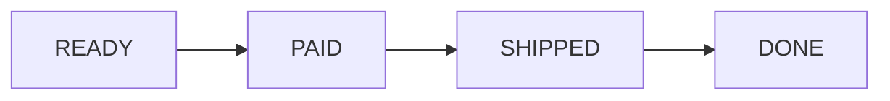

# 3주차 8일차 - enum 열거형, switch, 상태 모델링

## 오늘의 목표

오늘은 `enum`을 다룬다. 열거형은 정해진 선택지를 하나의 자료형으로 묶는다. 단순히 상수 이름을 외우는 데서 끝내지 않고, `switch`, 배열, 반복문, 필드, 생성자가 결합된 코드를 추적한다.

- 열거형이 정해진 값의 집합이라는 것을 설명할 수 있다.
- 문자열이나 숫자 대신 열거형을 사용할 때의 장점을 이해한다.
- `enum` 변수 선언, 비교, `switch` 분기를 읽을 수 있다.
- `values()`, `ordinal()`, `name()`의 결과를 예측할 수 있다.
- 필드와 생성자를 가진 열거형 코드를 추적할 수 있다.
- 열거형, 배열, 반복문이 결합된 실기형 코드를 풀 수 있다.

## 3시간 수업 구성

| 시간 | 내용 |
|---|---|
| 0:00 ~ 0:25 | 열거형의 필요성과 기본 선언 |
| 0:25 ~ 0:55 | 비교, `switch`, 배열 결합 |
| 0:55 ~ 1:20 | `values()`, `ordinal()`, `name()` |
| 1:20 ~ 1:30 | 쉬는 시간 |
| 1:30 ~ 2:00 | 필드와 생성자가 있는 enum |
| 2:00 ~ 2:35 | 상태 모델링과 실기형 추적 |
| 2:35 ~ 3:00 | 혼자 연습 문제와 오답 점검 |

---

## 1. 정해진 선택지를 표현하는 방법

주문 상태를 문자열로 표현해보자.

```java
String status = "PAID";
```

문자열은 자유롭게 입력할 수 있다.

```java
String status = "PAD";    // 오타
String status = "HELLO";  // 의미 없는 값
```

숫자로 표현해도 문제가 있다.

```java
int status = 2;
```

`2`가 결제 완료인지 배송 중인지 코드만 보고 알기 어렵다.

열거형은 가능한 선택지를 미리 제한한다.

```java
enum OrderStatus {
    READY, PAID, SHIPPED, DONE
}
```

```text
OrderStatus에 들어갈 수 있는 값
  |
  +-- READY
  +-- PAID
  +-- SHIPPED
  +-- DONE
```

---

## 2. enum 기본 선언과 사용

```java
enum Direction {
    NORTH, SOUTH, EAST, WEST
}

class Main {
    public static void main(String[] args) {
        Direction d = Direction.EAST;
        System.out.println(d);
    }
}
```

출력:

```text
EAST
```

`Direction`은 자료형이고 `Direction.EAST`는 그 자료형에 속하는 값이다.

| 코드 | 의미 |
|---|---|
| `enum Direction` | `Direction` 열거형 선언 |
| `Direction d` | 열거형 타입 변수 선언 |
| `Direction.EAST` | 열거형 값 선택 |

---

## 3. 열거형 비교

열거형 값은 `==`로 비교할 수 있다.

```java
enum Level {
    LOW, HIGH
}

class Main {
    public static void main(String[] args) {
        Level level = Level.HIGH;

        if (level == Level.HIGH) {
            System.out.println("high");
        } else {
            System.out.println("low");
        }
    }
}
```

출력:

```text
high
```

문자열 비교에서 `==`와 `.equals()`를 구분해야 했던 것과 달리, 열거형 상수 비교에는 `==`를 사용할 수 있다.

---

## 4. switch와 enum

열거형은 `switch`와 자주 함께 사용한다.

```java
enum Grade {
    A, B, C
}

class Main {
    public static void main(String[] args) {
        Grade grade = Grade.B;

        switch (grade) {
            case A:
                System.out.println(100);
                break;
            case B:
                System.out.println(80);
                break;
            default:
                System.out.println(60);
        }
    }
}
```

출력:

```text
80
```

주의:

```java
case B:
```

`switch (grade)` 안의 `case`에는 보통 `Grade.B`가 아니라 상수 이름 `B`만 쓴다.

### break를 빠뜨리면?

```java
enum Grade {
    A, B, C
}

class Main {
    public static void main(String[] args) {
        Grade grade = Grade.B;

        switch (grade) {
            case A:
                System.out.print("A");
            case B:
                System.out.print("B");
            case C:
                System.out.print("C");
        }
    }
}
```

출력:

```text
BC
```

`B`부터 시작한 뒤 `break`가 없어서 아래 `C`까지 이어서 실행한다. 이 현상을 fall-through라고 한다.

---

## 5. values(): 모든 열거형 값 꺼내기

`values()`는 열거형의 모든 값을 선언 순서대로 배열로 반환한다.

```java
enum Color {
    RED, GREEN, BLUE
}

class Main {
    public static void main(String[] args) {
        Color[] colors = Color.values();

        for (int i = 0; i < colors.length; i++) {
            System.out.println(colors[i]);
        }
    }
}
```

출력:

```text
RED
GREEN
BLUE
```

시각화:

```text
Color.values()
      |
      v
+-------+-------+------+
| RED   | GREEN | BLUE |
+-------+-------+------+
   [0]     [1]    [2]
```

---

## 6. ordinal()과 name()

```java
enum Color {
    RED, GREEN, BLUE
}

class Main {
    public static void main(String[] args) {
        Color c = Color.GREEN;

        System.out.println(c.ordinal());
        System.out.println(c.name());
    }
}
```

출력:

```text
1
GREEN
```

| 메서드 | 의미 | `Color.GREEN` 결과 |
|---|---|---|
| `ordinal()` | 선언 순서 위치, 0부터 시작 | `1` |
| `name()` | 선언한 상수 이름을 문자열로 반환 | `"GREEN"` |

주의: `ordinal()`은 화면 표시나 DB 저장용 번호로 사용하는 것을 피한다. 선언 순서를 바꾸면 값도 달라진다. 실기 코드 추적에서는 결과를 계산할 수 있어야 하지만, 실제 프로그램 설계에서는 별도 필드를 두는 편이 안전하다.

---

## 7. valueOf(): 문자열을 열거형 값으로 바꾸기

```java
enum Color {
    RED, GREEN, BLUE
}

class Main {
    public static void main(String[] args) {
        Color c = Color.valueOf("BLUE");
        System.out.println(c);
    }
}
```

출력:

```text
BLUE
```

문자열이 정확히 일치해야 한다.

```java
Color.valueOf("blue"); // 실행 중 오류
```

대소문자가 다르거나 존재하지 않는 이름을 넘기면 `IllegalArgumentException`이 발생한다.

---

## 8. 필드와 생성자를 가진 enum

열거형 상수마다 데이터를 함께 보관할 수 있다.

```java
enum Level {
    LOW(1),
    MIDDLE(2),
    HIGH(3);

    int score;

    Level(int score) {
        this.score = score;
    }
}

class Main {
    public static void main(String[] args) {
        System.out.println(Level.LOW.score);
        System.out.println(Level.HIGH.score);
    }
}
```

출력:

```text
1
3
```

### 구조 시각화

```text
LOW(1)    -> Level 객체: score = 1
MIDDLE(2) -> Level 객체: score = 2
HIGH(3)   -> Level 객체: score = 3
```

열거형 상수도 각각 하나의 객체라고 생각하면 이해하기 쉽다.

주의: 상수 목록 뒤에 필드나 메서드를 작성할 때 세미콜론 `;`이 필요하다.

```java
HIGH(3);
```

---

## 9. enum에 메서드 추가하기

```java
enum Size {
    SMALL(10),
    LARGE(20);

    private int price;

    Size(int price) {
        this.price = price;
    }

    int getPrice() {
        return price;
    }
}

class Main {
    public static void main(String[] args) {
        System.out.println(Size.LARGE.getPrice());
    }
}
```

출력:

```text
20
```

앞에서 배운 클래스의 필드, 생성자, 메서드 개념이 그대로 연결된다.

---

## 10. 배열, 반복문과 결합

```java
enum Product {
    PEN(500),
    NOTE(1000),
    BAG(3000);

    int price;

    Product(int price) {
        this.price = price;
    }
}

class Main {
    public static void main(String[] args) {
        Product[] products = Product.values();
        int sum = 0;

        for (int i = 0; i < products.length; i++) {
            sum += products[i].price;
        }

        System.out.println(sum);
    }
}
```

상태표:

| i | `products[i]` | `price` | sum |
|---:|---|---:|---:|
| 0 | `PEN` | 500 | 500 |
| 1 | `NOTE` | 1000 | 1500 |
| 2 | `BAG` | 3000 | 4500 |

출력:

```text
4500
```

---

## 11. 상태 모델링

열거형은 상태를 표현할 때 유용하다.

```java
enum OrderStatus {
    READY, PAID, SHIPPED, DONE
}

class Order {
    OrderStatus status = OrderStatus.READY;

    void next() {
        switch (status) {
            case READY:
                status = OrderStatus.PAID;
                break;
            case PAID:
                status = OrderStatus.SHIPPED;
                break;
            case SHIPPED:
                status = OrderStatus.DONE;
                break;
            default:
                break;
        }
    }
}

class Main {
    public static void main(String[] args) {
        Order order = new Order();

        for (int i = 0; i < 3; i++) {
            order.next();
            System.out.println(order.status);
        }
    }
}
```

출력:

```text
PAID
SHIPPED
DONE
```

상태 흐름:



---

## 12. 실기 문제 추적 순서

```text
1. enum 상수를 선언 순서대로 적는다.
2. ordinal()이 있으면 0부터 번호를 붙인다.
3. 상수 괄호 안 값이 있으면 필드와 연결한다.
4. values()가 있으면 선언 순서 배열을 그린다.
5. switch가 있으면 시작 case와 break 위치를 확인한다.
6. 반복문이면 상태표를 만든다.
7. 상태 변경이 있으면 변경 전과 변경 후를 분리해서 적는다.
```

---

## 13. 실전 실기형 예제 1

다음 코드의 출력 결과를 쓰시오.

```java
enum Day {
    MON, TUE, WED
}

class Main {
    public static void main(String[] args) {
        Day[] arr = Day.values();

        for (int i = 0; i < arr.length; i++) {
            System.out.print(arr[i].ordinal());
        }
    }
}
```

정답:

```text
012
```

---

## 14. 실전 실기형 예제 2

다음 코드의 출력 결과를 쓰시오.

```java
enum Code {
    A(2), B(3), C(5);

    int value;

    Code(int value) {
        this.value = value;
    }
}

class Main {
    public static void main(String[] args) {
        int result = 1;

        for (Code code : Code.values()) {
            result *= code.value;
        }

        System.out.println(result);
    }
}
```

상태표:

| 상수 | `value` | result |
|---|---:|---:|
| 시작 | - | 1 |
| `A` | 2 | 2 |
| `B` | 3 | 6 |
| `C` | 5 | 30 |

정답:

```text
30
```

---

## 15. 실전 실기형 예제 3

다음 코드의 출력 결과를 쓰시오.

```java
enum State {
    START, RUN, END
}

class Main {
    public static void main(String[] args) {
        State state = State.RUN;

        switch (state) {
            case START:
                System.out.print("A");
            case RUN:
                System.out.print("B");
            case END:
                System.out.print("C");
        }
    }
}
```

정답:

```text
BC
```

`RUN`에서 시작하고 `break`가 없으므로 `END`까지 이어서 실행한다.

---

## 16. 직접 코딩 실습

### 실습 1: 계절 출력

```text
1. enum Season에 SPRING, SUMMER, FALL, WINTER를 선언한다.
2. Season 변수를 만들고 SUMMER를 저장한다.
3. switch를 사용해 "hot"을 출력한다.
4. 다른 계절도 각각 알맞은 문자열을 출력한다.
```

### 실습 2: 메뉴 가격 합계

```text
1. enum Menu에 COFFEE(3000), TEA(2500), JUICE(4000)을 선언한다.
2. price 필드와 생성자를 작성한다.
3. Menu.values()와 반복문을 사용해 전체 합계를 출력한다.
```

### 실습 3: 상태 변화 로그

`OrderStatus` 예제에 로그를 추가한다.

```java
System.out.println("변경 전: " + status);
System.out.println("변경 후: " + status);
```

`next()`를 4번 호출했을 때 `DONE` 이후 상태가 어떻게 되는지 확인한다.

---

## 17. 오늘의 혼자 연습 문제

### 문제 1

다음 코드의 출력 결과를 쓰시오.

```java
enum Fruit {
    APPLE, BANANA, ORANGE
}

class Main {
    public static void main(String[] args) {
        Fruit f = Fruit.BANANA;
        System.out.println(f.name());
        System.out.println(f.ordinal());
    }
}
```

### 문제 2

다음 코드의 출력 결과를 쓰시오.

```java
enum Mode {
    A, B, C
}

class Main {
    public static void main(String[] args) {
        Mode mode = Mode.A;

        switch (mode) {
            case A:
                System.out.print("1");
            case B:
                System.out.print("2");
                break;
            default:
                System.out.print("3");
        }
    }
}
```

### 문제 3

다음 코드의 출력 결과를 쓰시오.

```java
enum Point {
    X(1), Y(2), Z(4);

    int n;

    Point(int n) {
        this.n = n;
    }
}

class Main {
    public static void main(String[] args) {
        int sum = 0;

        for (Point p : Point.values()) {
            sum += p.n * p.ordinal();
        }

        System.out.println(sum);
    }
}
```

### 문제 4

`Color.valueOf("red")`가 실행 중 오류를 일으키는 이유를 설명하시오. 다음 선언을 기준으로 한다.

```java
enum Color {
    RED, GREEN, BLUE
}
```

### 문제 5

다음 조건을 만족하는 코드를 작성하시오.

```text
- enum Ticket에 CHILD(5000), ADULT(10000), SENIOR(7000)을 선언한다.
- price 필드와 생성자를 작성한다.
- Ticket.values()를 반복하면서 각 티켓의 이름과 가격을 출력한다.
- 전체 가격 합계를 출력한다.
```

---

## 18. 정답과 해설

### 문제 1 정답

```text
BANANA
1
```

`name()`은 상수 이름, `ordinal()`은 0부터 시작하는 선언 위치를 반환한다.

### 문제 2 정답

```text
12
```

`A`에서 실행을 시작한다. `break`가 없으므로 `B`도 실행하고, `B`의 `break`에서 종료한다.

### 문제 3 정답

```text
10
```

상태표:

| 상수 | `n` | `ordinal()` | 더하는 값 |
|---|---:|---:|---:|
| `X` | 1 | 0 | 0 |
| `Y` | 2 | 1 | 2 |
| `Z` | 4 | 2 | 8 |
| 합계 | - | - | 10 |

### 문제 4 정답

`valueOf()`는 선언한 상수 이름과 정확히 일치하는 문자열만 변환한다. 선언된 이름은 `"RED"`이며 `"red"`는 대소문자가 다르므로 `IllegalArgumentException`이 발생한다.

### 문제 5 예시 정답

```java
enum Ticket {
    CHILD(5000),
    ADULT(10000),
    SENIOR(7000);

    int price;

    Ticket(int price) {
        this.price = price;
    }
}

class Main {
    public static void main(String[] args) {
        int sum = 0;

        for (Ticket ticket : Ticket.values()) {
            System.out.println(ticket.name() + ":" + ticket.price);
            sum += ticket.price;
        }

        System.out.println(sum);
    }
}
```

출력:

```text
CHILD:5000
ADULT:10000
SENIOR:7000
22000
```

---

## 19. 오늘의 마무리 체크

- `enum`은 정해진 선택지를 하나의 자료형으로 묶는다.
- 열거형 값은 `열거형이름.상수이름`으로 사용한다.
- 열거형 값은 `==`로 비교할 수 있다.
- `values()`는 모든 상수를 선언 순서대로 담은 배열을 반환한다.
- `ordinal()`은 0부터 시작하는 선언 위치다.
- `name()`은 선언한 상수 이름을 문자열로 반환한다.
- 열거형도 필드, 생성자, 메서드를 가질 수 있다.
- `switch`에서는 `break` 유무를 반드시 확인한다.

## 20. 5분 오답 노트

```text
1. enum은 정해진 ______ 를 하나의 자료형으로 묶는다.
2. 모든 enum 상수 배열은 ______ 메서드로 구한다.
3. 선언 위치 번호는 ______ 메서드로 구하며 0부터 시작한다.
4. 선언한 상수 이름 문자열은 ______ 메서드로 구한다.
5. switch에서 ______ 가 없으면 아래 case까지 이어서 실행될 수 있다.
```

