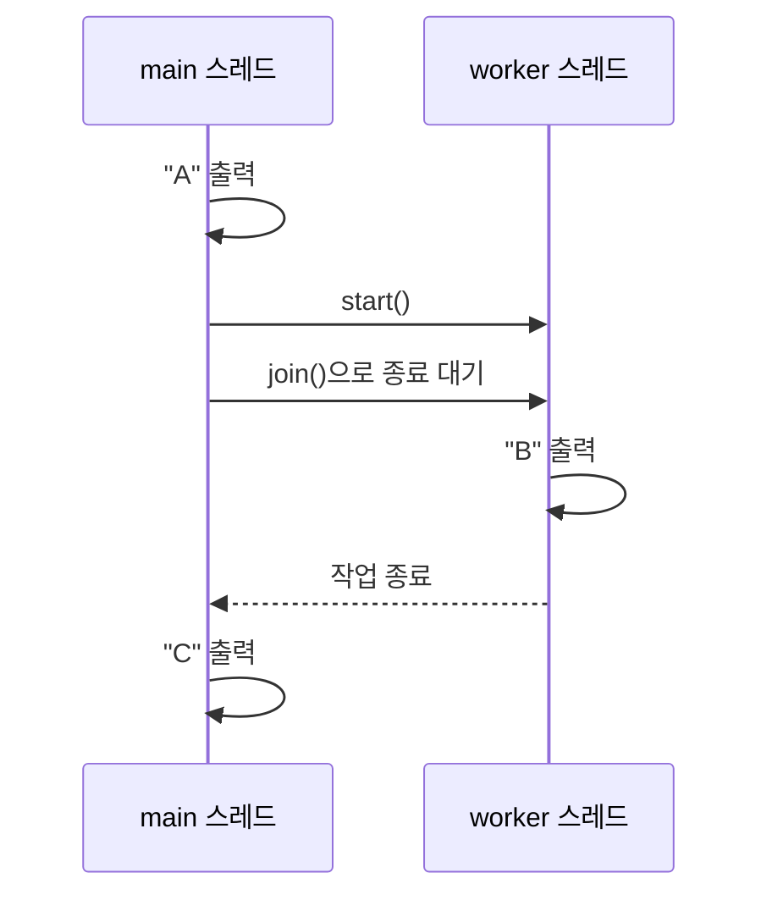

# 3주차 9일차 - Thread 실행 흐름, join, 동기화 기초

## 오늘의 목표

오늘은 Java 스레드를 다룬다. 스레드는 한 프로그램 안에서 여러 작업 흐름을 진행하게 한다. 이 주제는 코드 한 줄씩 순서대로만 읽으면 틀리기 쉽다. 특히 실행 순서가 항상 같지 않을 수 있다는 점을 구분해야 한다.

- 프로세스와 스레드의 차이를 비전공자 수준에서 설명할 수 있다.
- `Thread` 상속 방식과 `Runnable` 구현 방식을 읽을 수 있다.
- `start()`와 `run()` 직접 호출의 차이를 설명할 수 있다.
- 여러 스레드의 출력 순서가 비결정적일 수 있음을 이해한다.
- `join()`으로 완료 순서를 제어하는 코드를 추적할 수 있다.
- 공유 변수와 경쟁 상태의 위험을 이해한다.
- `synchronized`가 필요한 이유를 설명할 수 있다.

## 먼저 알아둘 점

스레드 문제는 두 종류로 나누어야 한다.

```text
1. 출력 순서를 하나로 확정할 수 있는 문제
   예: run() 직접 호출, join()으로 순서 제어

2. 출력 순서를 하나로 확정할 수 없는 문제
   예: 여러 스레드를 start()만 하고 서로 기다리지 않음
```

실기 문제를 풀 때 순서를 확정할 근거가 없으면 임의로 하나의 답을 만들면 안 된다.

## 3시간 수업 구성

| 시간 | 내용 |
|---|---|
| 0:00 ~ 0:25 | 프로세스, 스레드, 실행 흐름 |
| 0:25 ~ 0:55 | `Thread` 상속과 `start()` |
| 0:55 ~ 1:20 | `Runnable`, `run()` 직접 호출 비교 |
| 1:20 ~ 1:30 | 쉬는 시간 |
| 1:30 ~ 1:55 | `sleep()`, `join()` |
| 1:55 ~ 2:20 | 공유 변수, 경쟁 상태, `synchronized` |
| 2:20 ~ 2:40 | 실기형 코드 추적 |
| 2:40 ~ 3:00 | 혼자 연습 문제와 오답 점검 |

---

## 1. 프로세스와 스레드

프로그램을 실행하면 프로세스가 된다. 한 프로세스 안에서 실제 작업을 진행하는 흐름이 스레드다.

```text
Java 프로그램 실행
        |
        v
프로세스
+----------------------------------+
| main 스레드                      |
|                                  |
| 필요하면 추가 스레드 생성        |
| worker-1 스레드   worker-2 스레드 |
+----------------------------------+
```

Java 프로그램은 `main()`을 실행하는 main 스레드에서 시작한다.

```java
class Main {
    public static void main(String[] args) {
        System.out.println("main");
    }
}
```

---

## 2. 순차 실행과 동시 실행 느낌 비교

### 순차 실행

```text
작업 A 시작 -> 작업 A 종료 -> 작업 B 시작 -> 작업 B 종료
```

### 여러 스레드 실행

```text
작업 A 시작 -----> 작업 A 진행 -----> 작업 A 종료
        작업 B 시작 -----> 작업 B 진행 -----> 작업 B 종료
```

실제로 어느 스레드가 어느 순간 실행될지는 JVM과 운영체제 스케줄러의 영향을 받는다.

---

## 3. Thread 클래스를 상속하는 방법

```java
class Worker extends Thread {
    public void run() {
        System.out.println("worker");
    }
}

class Main {
    public static void main(String[] args) {
        Worker w = new Worker();
        w.start();
    }
}
```

출력:

```text
worker
```

### 핵심 흐름

```mermaid
flowchart LR
    A[main 스레드] --> B[new Worker]
    B --> C[w.start()]
    C --> D[새 작업 스레드 시작]
    D --> E[Worker.run 실행]
```

`start()`는 새 스레드 실행을 요청한다. 새 스레드가 시작되면 그 스레드가 `run()`을 실행한다.

---

## 4. start()와 run() 직접 호출은 다르다

### start() 호출

```java
class Worker extends Thread {
    public void run() {
        System.out.print("B");
    }
}

class Main {
    public static void main(String[] args) {
        Worker w = new Worker();
        System.out.print("A");
        w.start();
        System.out.print("C");
    }
}
```

가능한 출력 예:

```text
ABC
ACB
```

`A`는 `start()` 전이므로 먼저 출력된다. 하지만 새 스레드의 `B`와 main 스레드의 `C` 중 누가 먼저인지는 확정할 수 없다.

### run() 직접 호출

```java
class Worker extends Thread {
    public void run() {
        System.out.print("B");
    }
}

class Main {
    public static void main(String[] args) {
        Worker w = new Worker();
        System.out.print("A");
        w.run();
        System.out.print("C");
    }
}
```

출력:

```text
ABC
```

`run()`을 직접 호출하면 일반 메서드 호출과 같다. 새 스레드를 만들지 않고 main 스레드가 `run()`을 끝까지 실행한다.

### 비교

| 호출 | 새 스레드 생성 | 실행 특징 |
|---|---|---|
| `w.start()` | 생성 | 새 스레드가 `run()` 실행 |
| `w.run()` | 생성하지 않음 | 현재 스레드에서 일반 메서드처럼 실행 |

---

## 5. 여러 스레드 출력은 순서가 달라질 수 있다

```java
class Worker extends Thread {
    String text;

    Worker(String text) {
        this.text = text;
    }

    public void run() {
        for (int i = 0; i < 3; i++) {
            System.out.print(text);
        }
    }
}

class Main {
    public static void main(String[] args) {
        Worker a = new Worker("A");
        Worker b = new Worker("B");

        a.start();
        b.start();
    }
}
```

가능한 출력 예:

```text
AAABBB
ABABAB
ABBBAA
```

중요한 사실:

```text
A는 총 3번 출력된다.
B는 총 3번 출력된다.
하지만 섞이는 순서는 하나로 확정할 수 없다.
```

스레드 코드에서 “항상 위에서 아래로 출력된다”고 가정하면 안 된다.

---

## 6. Runnable 인터페이스를 구현하는 방법

스레드 작업은 `Runnable` 인터페이스로도 만들 수 있다.

```java
class Task implements Runnable {
    public void run() {
        System.out.println("task");
    }
}

class Main {
    public static void main(String[] args) {
        Task task = new Task();
        Thread t = new Thread(task);
        t.start();
    }
}
```

출력:

```text
task
```

구조:

```text
Task 객체: 해야 할 작업 run() 보관
    |
    v
new Thread(task)
    |
    v
t.start()
    |
    v
새 스레드가 task.run() 실행
```

### 두 방식 비교

| 방식 | 코드 | 특징 |
|---|---|---|
| `Thread` 상속 | `class Worker extends Thread` | 문법이 직관적 |
| `Runnable` 구현 | `class Task implements Runnable` | 작업과 스레드 객체를 분리 |

Java는 클래스 다중 상속을 지원하지 않는다. 이미 다른 클래스를 상속해야 한다면 `Runnable` 방식이 유용하다.

---

## 7. 익명 객체와 람다식 맛보기

실제 코드에서는 짧은 작업을 다음처럼 작성하기도 한다.

```java
class Main {
    public static void main(String[] args) {
        Thread t = new Thread(() -> {
            System.out.println("task");
        });

        t.start();
    }
}
```

출력:

```text
task
```

`Runnable`의 `run()`에 들어갈 작업을 짧게 전달한 형태다. 이 회차의 핵심은 람다 문법 자체보다 `t.start()`가 새 스레드에서 작업을 실행한다는 점이다.

---

## 8. sleep(): 현재 스레드 잠시 멈추기

```java
class Worker extends Thread {
    public void run() {
        try {
            System.out.print("A");
            Thread.sleep(1000);
            System.out.print("B");
        } catch (InterruptedException e) {
            System.out.print("E");
        }
    }
}
```

`Thread.sleep(1000)`은 현재 실행 중인 스레드를 약 1000밀리초 동안 멈춘다.

주의:

```text
sleep(1000)이 다른 스레드의 정확한 실행 순서를 완전히 보장하는 것은 아니다.
시간 기반 추측보다 join() 같은 명시적 대기를 확인해야 한다.
```

`sleep()`은 `InterruptedException` 처리가 필요하다.

---

## 9. join(): 다른 스레드가 끝날 때까지 기다리기

```java
class Worker extends Thread {
    public void run() {
        System.out.print("B");
    }
}

class Main {
    public static void main(String[] args) throws InterruptedException {
        Worker w = new Worker();

        System.out.print("A");
        w.start();
        w.join();
        System.out.print("C");
    }
}
```

출력:

```text
ABC
```

### 흐름



`join()` 때문에 main 스레드는 worker가 끝나기 전까지 `"C"`를 출력할 수 없다.

---

## 10. start()는 같은 Thread 객체에서 두 번 호출할 수 없다

```java
Worker w = new Worker();
w.start();
// w.start(); // 실행 중 오류
```

한 번 시작한 `Thread` 객체를 다시 시작하면 `IllegalThreadStateException`이 발생한다.

새 작업을 다시 시작하려면 새 `Thread` 객체를 만든다.

```java
new Worker().start();
new Worker().start();
```

---

## 11. 공유 변수와 경쟁 상태

여러 스레드가 같은 객체의 값을 변경할 수 있다.

```java
class Counter {
    int value = 0;

    void increase() {
        value++;
    }
}
```

`value++`는 한 번에 끝나는 마법 같은 동작이 아니다. 개념적으로 다음 단계를 거친다.

```text
1. value 읽기
2. 1 더하기
3. value에 저장하기
```

두 스레드가 동시에 실행하면 문제가 생길 수 있다.

```text
초기 value = 0

스레드 A: value 읽기 -> 0
스레드 B: value 읽기 -> 0
스레드 A: 1 저장
스레드 B: 1 저장

기대값: 2
실제값: 1이 될 수 있음
```

이처럼 여러 실행 흐름이 공유 데이터를 동시에 변경해 결과가 달라질 수 있는 상황을 경쟁 상태라고 한다.

---

## 12. synchronized 기초

```java
class Counter {
    int value = 0;

    synchronized void increase() {
        value++;
    }
}
```

`synchronized`를 붙이면 한 스레드가 `increase()`를 실행하는 동안 같은 객체의 해당 동기화 메서드에 다른 스레드가 동시에 들어가지 못하게 한다.

```text
스레드 A increase() 진입
        |
        | 스레드 B는 대기
        v
스레드 A 종료
        |
        v
스레드 B increase() 진입
```

이 회차에서는 동기화의 세부 구현보다 다음을 기억한다.

```text
공유 데이터 + 여러 스레드의 변경
=> 실행 결과가 예상과 달라질 수 있음
=> 필요한 범위를 synchronized로 보호
```

---

## 13. 동기화된 카운터 예제

```java
class Counter {
    int value = 0;

    synchronized void increase() {
        value++;
    }
}

class Worker extends Thread {
    Counter counter;

    Worker(Counter counter) {
        this.counter = counter;
    }

    public void run() {
        for (int i = 0; i < 1000; i++) {
            counter.increase();
        }
    }
}

class Main {
    public static void main(String[] args) throws InterruptedException {
        Counter counter = new Counter();
        Worker a = new Worker(counter);
        Worker b = new Worker(counter);

        a.start();
        b.start();

        a.join();
        b.join();

        System.out.println(counter.value);
    }
}
```

출력:

```text
2000
```

### 참조 구조

```text
a.counter ----\
               >---- Counter 객체: value
b.counter ----/

두 Worker가 같은 Counter 객체를 공유한다.
increase()는 synchronized이므로 한 번에 한 스레드씩 변경한다.
main은 join()으로 둘 다 끝난 뒤 값을 출력한다.
```

---

## 14. 실기 문제 추적 순서

```text
1. main 스레드가 위에서 아래로 실행하는 코드를 표시한다.
2. start()와 run() 직접 호출을 구분한다.
3. start()가 있으면 새 실행 흐름을 옆에 따로 그린다.
4. join()이 있으면 어느 스레드가 누구를 기다리는지 표시한다.
5. 출력 순서를 확정할 수 있는지 먼저 판단한다.
6. 공유 객체가 있으면 여러 스레드가 같은 참조를 갖는지 확인한다.
7. 공유 값을 변경하면 synchronized 여부를 확인한다.
```

### 흐름 그리기 예시

```text
main 스레드        worker 스레드
-----------        -------------
print("A")
start() ----------> run 시작
join() 대기         print("B")
                   run 종료
print("C")
```

---

## 15. 실전 실기형 예제 1

다음 코드의 출력 결과를 쓰시오.

```java
class Worker extends Thread {
    public void run() {
        System.out.print("2");
    }
}

class Main {
    public static void main(String[] args) {
        Worker w = new Worker();
        System.out.print("1");
        w.run();
        System.out.print("3");
    }
}
```

정답:

```text
123
```

`run()` 직접 호출은 일반 메서드 호출이다. 새 스레드가 생기지 않는다.

---

## 16. 실전 실기형 예제 2

다음 코드에서 가능한 출력 결과를 모두 쓰시오.

```java
class Worker extends Thread {
    public void run() {
        System.out.print("2");
    }
}

class Main {
    public static void main(String[] args) {
        Worker w = new Worker();
        System.out.print("1");
        w.start();
        System.out.print("3");
    }
}
```

정답:

```text
123
132
```

`"1"`은 `start()` 전에 출력된다. 이후 worker의 `"2"`와 main의 `"3"` 순서는 확정할 수 없다.

---

## 17. 실전 실기형 예제 3

다음 코드의 출력 결과를 쓰시오.

```java
class Worker extends Thread {
    public void run() {
        System.out.print("B");
    }
}

class Main {
    public static void main(String[] args) throws InterruptedException {
        Worker w = new Worker();

        System.out.print("A");
        w.start();
        w.join();
        System.out.print("C");
    }
}
```

정답:

```text
ABC
```

main 스레드는 `w.join()`에서 worker 종료를 기다린다.

---

## 18. 실전 실기형 예제 4

다음 코드의 출력 결과를 쓰시오.

```java
class Task implements Runnable {
    public void run() {
        System.out.print("X");
    }
}

class Main {
    public static void main(String[] args) throws InterruptedException {
        Thread t = new Thread(new Task());

        System.out.print("A");
        t.start();
        t.join();
        System.out.print("B");
    }
}
```

정답:

```text
AXB
```

`Runnable` 객체의 `run()`을 새 스레드가 실행한다. `join()` 때문에 `"B"`는 `"X"` 뒤에 출력된다.

---

## 19. 직접 코딩 실습

### 실습 1: start()와 run() 비교

다음 두 코드를 각각 여러 번 실행한다.

```java
w.run();
```

```java
w.start();
```

출력 전후에 main 스레드 로그를 추가한다.

```java
System.out.println("main-before");
System.out.println("main-after");
```

실행 흐름이 어떻게 다른지 적는다.

### 실습 2: Runnable로 바꾸기

`Thread`를 상속한 `Worker` 예제를 `Runnable` 구현 방식으로 바꾼다.

```text
Worker extends Thread
        |
        v
Task implements Runnable
Thread t = new Thread(new Task())
```

### 실습 3: join() 전후 비교

`join()`을 넣었을 때와 뺐을 때를 비교한다.

```java
t.start();
// t.join();
System.out.println("main-end");
```

### 실습 4: 공유 카운터 확인

카운터 예제에서 `synchronized`를 제거하고 여러 번 실행한다. 결과가 항상 기대값과 같은지 확인한 뒤 다시 `synchronized`를 붙인다.

주의: 실행 환경에 따라 동기화가 없어도 우연히 기대값이 나올 수 있다. 한 번 맞았다고 안전한 코드는 아니다.

---

## 20. 오늘의 혼자 연습 문제

### 문제 1

다음 코드의 출력 결과를 쓰시오.

```java
class T extends Thread {
    public void run() {
        System.out.print("B");
    }
}

class Main {
    public static void main(String[] args) {
        T t = new T();
        System.out.print("A");
        t.run();
        System.out.print("C");
    }
}
```

### 문제 2

다음 코드의 가능한 출력 결과를 모두 쓰시오.

```java
class T extends Thread {
    public void run() {
        System.out.print("B");
    }
}

class Main {
    public static void main(String[] args) {
        T t = new T();
        System.out.print("A");
        t.start();
        System.out.print("C");
    }
}
```

### 문제 3

다음 코드의 출력 결과를 쓰시오.

```java
class T extends Thread {
    public void run() {
        System.out.print("B");
    }
}

class Main {
    public static void main(String[] args) throws InterruptedException {
        T t = new T();
        System.out.print("A");
        t.start();
        t.join();
        System.out.print("C");
    }
}
```

### 문제 4

다음 코드의 문제점을 설명하시오.

```java
class Counter {
    int value = 0;

    void increase() {
        value++;
    }
}
```

여러 스레드가 같은 `Counter` 객체의 `increase()`를 동시에 호출한다고 가정한다.

### 문제 5

다음 조건을 만족하는 코드를 작성하시오.

```text
- Task 클래스는 Runnable을 구현한다.
- run()에서 "WORK"를 출력한다.
- main에서 Thread 객체를 만들고 시작한다.
- join()을 사용해 작업 종료를 기다린다.
- 마지막에 "END"를 출력한다.
```

---

## 21. 정답과 해설

### 문제 1 정답

```text
ABC
```

`run()`을 직접 호출했으므로 main 스레드가 일반 메서드처럼 순서대로 실행한다.

### 문제 2 정답

```text
ABC
ACB
```

`A`는 항상 먼저다. 하지만 `start()` 뒤에는 worker의 `B`와 main의 `C` 중 어느 것이 먼저 실행될지 확정할 수 없다.

### 문제 3 정답

```text
ABC
```

main 스레드는 `join()`에서 기다린다. worker가 `B`를 출력하고 종료한 뒤 `C`가 출력된다.

### 문제 4 정답

`value++`는 읽기, 증가, 저장 단계로 나뉠 수 있다. 여러 스레드가 동시에 실행하면 증가 결과 일부가 사라질 수 있다. 다음처럼 필요한 범위를 동기화할 수 있다.

```java
class Counter {
    int value = 0;

    synchronized void increase() {
        value++;
    }
}
```

### 문제 5 예시 정답

```java
class Task implements Runnable {
    public void run() {
        System.out.println("WORK");
    }
}

class Main {
    public static void main(String[] args) throws InterruptedException {
        Thread t = new Thread(new Task());
        t.start();
        t.join();
        System.out.println("END");
    }
}
```

출력:

```text
WORK
END
```

---

## 22. 시험에서 자주 하는 실수

| 실수 | 올바른 판단 |
|---|---|
| `run()`만 보고 새 스레드라고 생각함 | `start()`를 통해 실행했는지 확인 |
| 코드 줄 순서대로 출력된다고 단정함 | 여러 스레드라면 순서 확정 근거 확인 |
| `sleep()`만 있으면 순서가 완전히 보장된다고 생각함 | 명시적 대기는 `join()` 등으로 확인 |
| `value++`는 항상 안전하다고 생각함 | 공유 변경이면 경쟁 상태 확인 |
| 한 번 실행 결과만 보고 순서를 단정함 | 가능한 실행 순서를 논리적으로 판단 |

---

## 23. 오늘의 마무리 체크

- Java 프로그램은 main 스레드에서 시작한다.
- `start()`는 새 스레드에서 `run()`이 실행되도록 요청한다.
- `run()` 직접 호출은 현재 스레드의 일반 메서드 호출이다.
- 여러 스레드의 실행 순서는 하나로 확정되지 않을 수 있다.
- `Runnable`은 스레드가 실행할 작업을 표현한다.
- `join()`은 대상 스레드가 끝날 때까지 현재 스레드를 기다리게 한다.
- 여러 스레드가 공유 값을 바꾸면 경쟁 상태가 발생할 수 있다.
- `synchronized`는 필요한 범위에 한 번에 한 스레드만 진입하도록 제어한다.

## 24. 5분 오답 노트

```text
1. 새 스레드 실행을 요청하는 메서드는 ______ 이다.
2. ______ 을 직접 호출하면 일반 메서드 호출처럼 실행된다.
3. 다른 스레드의 종료를 기다리는 메서드는 ______ 이다.
4. 여러 스레드가 공유 값을 동시에 변경해 결과가 달라질 수 있는 상황을 ______ 상태라고 한다.
5. 한 번에 한 스레드씩 실행하도록 보호할 때 사용하는 키워드는 ______ 이다.
```

