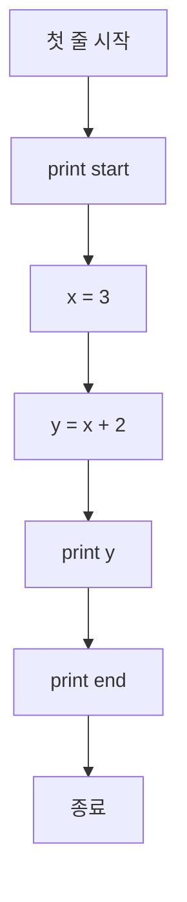
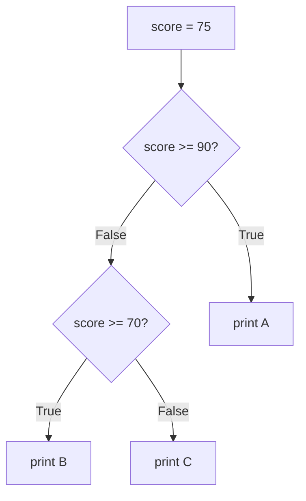

# 4주차 1일차 - Python 기본 구조, 변수, 리스트, 출력 추적

## 오늘의 목표

오늘은 Python 코드를 처음 보거나 Java/C만 조금 본 학생도 실기 문제를 읽을 수 있게 만드는 날이다. 목표는 "문법을 외운다"가 아니라, 코드 한 줄이 실행될 때 변수 값이 어떻게 바뀌는지 직접 추적하는 것이다.

- Python 프로그램의 실행 순서를 설명할 수 있다.
- `print`, 변수, 산술 연산, 조건문, 반복문을 읽을 수 있다.
- 리스트의 인덱스가 0부터 시작한다는 점을 이용해 값을 추적할 수 있다.
- `append`, `pop`, 대입, 얕은 복사의 차이를 구분할 수 있다.
- 시험형 코드의 출력 결과를 표로 예측할 수 있다.

## 3시간 수업 구성

| 시간 | 내용 |
|---|---|
| 0:00 ~ 0:20 | Python 실행 구조와 C/Java와의 차이 |
| 0:20 ~ 0:50 | 변수, 자료형, 산술 연산, 출력 |
| 0:50 ~ 1:20 | 조건문과 반복문 추적 |
| 1:20 ~ 1:30 | 쉬는 시간 |
| 1:30 ~ 2:10 | 리스트, 인덱스, 값 변경 |
| 2:10 ~ 2:40 | 리스트 참조, 복사, append/pop 실습 |
| 2:40 ~ 3:00 | 실기형 출력 예측 문제와 오답 정리 |

---

## 1. Python 코드는 위에서 아래로 실행된다

Python은 C의 `main()`이나 Java의 `public static void main(...)` 같은 시작 메서드를 반드시 쓰지 않는다. 파일의 첫 줄부터 위에서 아래로 실행된다.

```python
print("start")
x = 3
y = x + 2
print(y)
print("end")
```

출력:

```text
start
5
end
```

실행 흐름:



시험에서 Python 코드를 보면 먼저 다음 세 가지를 표시한다.

```text
1. 출력문 print가 몇 번 나오는가?
2. 변수 값이 바뀌는 줄은 어디인가?
3. 반복문 안에서 값이 몇 번 바뀌는가?
```

---

## 2. 변수는 값을 담는 이름이다

Python 변수는 자료형을 앞에 쓰지 않는다.

```python
a = 10
b = 3
c = a + b
print(c)
```

출력:

```text
13
```

변수 추적표:

| 실행 줄 | a | b | c | 설명 |
|---|---:|---:|---:|---|
| `a = 10` | 10 | - | - | a에 10 저장 |
| `b = 3` | 10 | 3 | - | b에 3 저장 |
| `c = a + b` | 10 | 3 | 13 | 10 + 3 계산 |
| `print(c)` | 10 | 3 | 13 | 13 출력 |

대입문은 항상 오른쪽을 먼저 계산하고 왼쪽에 저장한다.

```python
x = 5
x = x + 2
print(x)
```

실행 순서:

```text
1. 오른쪽 x + 2 계산: 5 + 2 = 7
2. 왼쪽 x에 7 저장
3. 기존 5는 사라짐
```

출력:

```text
7
```

---

## 3. Python 기본 자료형

| 자료형 | 예시 | 의미 |
|---|---|---|
| `int` | `10`, `-3` | 정수 |
| `float` | `3.14` | 실수 |
| `str` | `"hello"` | 문자열 |
| `bool` | `True`, `False` | 참/거짓 |
| `list` | `[1, 2, 3]` | 여러 값을 순서대로 저장 |
| `tuple` | `(1, 2)` | 변경할 수 없는 묶음 |
| `dict` | `{"a": 1}` | key와 value의 묶음 |

Python은 같은 변수에 다른 자료형을 다시 넣을 수 있다.

```python
x = 10
x = "ten"
print(x)
```

출력:

```text
ten
```

하지만 실기 코드 추적에서는 자료형이 계속 바뀌면 헷갈리기 쉽다. 

---

## 4. 산술 연산과 나눗셈

Python에서 나눗셈은 C/Java와 다르게 특히 중요하다.

| 연산자 | 의미 | 예시 | 결과 |
|---|---|---|---|
| `+` | 더하기 | `7 + 2` | `9` |
| `-` | 빼기 | `7 - 2` | `5` |
| `*` | 곱하기 | `7 * 2` | `14` |
| `/` | 실수 나눗셈 | `7 / 2` | `3.5` |
| `//` | 몫 | `7 // 2` | `3` |
| `%` | 나머지 | `7 % 2` | `1` |
| `**` | 거듭제곱 | `2 ** 3` | `8` |

```python
a = 7
b = 2
print(a / b)
print(a // b)
print(a % b)
```

출력:

```text
3.5
3
1
```

실기에서 정수 몫을 묻는 문제는 `//`가 자주 나온다.

---

## 5. 조건문 추적

Python은 중괄호 `{}` 대신 들여쓰기로 코드 블록을 구분한다.

```python
score = 75

if score >= 90:
    print("A")
elif score >= 70:
    print("B")
else:
    print("C")
```

출력:

```text
B
```

흐름도:



주의할 점:

```text
if / elif / else 묶음에서는 조건 하나가 참이 되면 아래 조건은 더 보지 않는다.
```

---

## 6. 반복문 추적

Python의 `range`는 끝 값을 포함하지 않는다.

```python
for i in range(1, 5):
    print(i)
```

출력:

```text
1
2
3
4
```

`range(1, 5)`는 1부터 4까지다.

```text
range(시작, 끝, 증가폭)
range(1, 5, 1) => 1, 2, 3, 4
range(1, 6, 2) => 1, 3, 5
range(5, 1, -1) => 5, 4, 3, 2
```

예제:

```python
total = 0

for i in range(1, 5):
    total += i

print(total)
```

추적표:

| 반복 | i | total 변경 |
|---:|---:|---:|
| 시작 | - | 0 |
| 1 | 1 | 0 + 1 = 1 |
| 2 | 2 | 1 + 2 = 3 |
| 3 | 3 | 3 + 3 = 6 |
| 4 | 4 | 6 + 4 = 10 |

출력:

```text
10
```

---

## 7. 리스트와 인덱스

리스트는 여러 값을 순서대로 저장하는 자료구조다.

```python
arr = [3, 5, 2, 4]
print(arr[0])
print(arr[2])
```

리스트 그림:

```text
인덱스:   0   1   2   3
값:      3   5   2   4
```

출력:

```text
3
2
```

인덱스는 0부터 시작한다. 길이가 4인 리스트의 마지막 인덱스는 3이다.

```python
arr = [3, 5, 2, 4]
print(len(arr))
print(arr[len(arr) - 1])
```

출력:

```text
4
4
```

---

## 8. 리스트 값 변경

```python
arr = [1, 2, 3]
arr[1] = 7
print(arr)
```

변경 전:

```text
인덱스:   0   1   2
값:      1   2   3
```

변경 후:

```text
인덱스:   0   1   2
값:      1   7   3
```

출력:

```text
[1, 7, 3]
```

반복문으로 리스트 합 구하기:

```python
arr = [3, 5, 2, 4]
total = 0

for i in range(len(arr)):
    total += arr[i]

print(total)
```

추적표:

| i | arr[i] | total |
|---:|---:|---:|
| 0 | 3 | 3 |
| 1 | 5 | 8 |
| 2 | 2 | 10 |
| 3 | 4 | 14 |

출력:

```text
14
```

---

## 9. append와 pop

`append`는 리스트 맨 뒤에 값을 추가한다.

```python
a = [1, 2]
a.append(3)
a.append(4)
print(a)
```

출력:

```text
[1, 2, 3, 4]
```

`pop`은 값을 꺼낸다. 인덱스를 생략하면 마지막 값을 꺼낸다.

```python
a = [1, 2, 3, 4]
x = a.pop()
y = a.pop(0)
print(x)
print(y)
print(a)
```

추적표:

| 실행 | a | x | y |
|---|---|---:|---:|
| 시작 | `[1, 2, 3, 4]` | - | - |
| `x = a.pop()` | `[1, 2, 3]` | 4 | - |
| `y = a.pop(0)` | `[2, 3]` | 4 | 1 |

출력:

```text
4
1
[2, 3]
```

---

## 10. 리스트 대입과 복사

Python 실기에서 가장 많이 틀리는 부분 중 하나다.

```python
a = [1, 2, 3]
b = a
b[0] = 9
print(a)
print(b)
```

출력:

```text
[9, 2, 3]
[9, 2, 3]
```

왜 그럴까?

```text
a ----+
      |
      v
   [1, 2, 3]
      ^
      |
b ----+
```

`b = a`는 리스트를 새로 복사하는 것이 아니라 같은 리스트를 같이 가리키게 만든다.

진짜 새 리스트를 만들고 싶으면 다음처럼 쓴다.

```python
a = [1, 2, 3]
b = a[:]
b[0] = 9
print(a)
print(b)
```

출력:

```text
[1, 2, 3]
[9, 2, 3]
```

---

## 11. 실기형 예제 1

다음 코드의 출력 결과를 예측하시오.

```python
a = [2, 4, 1, 3]
result = 0

for i in range(len(a)):
    if a[i] % 2 == 0:
        result += a[i]
    else:
        result -= a[i]

print(result)
```

추적표:

| i | a[i] | 짝수 여부 | result |
|---:|---:|---|---:|
| 0 | 2 | True | 0 + 2 = 2 |
| 1 | 4 | True | 2 + 4 = 6 |
| 2 | 1 | False | 6 - 1 = 5 |
| 3 | 3 | False | 5 - 3 = 2 |

정답:

```text
2
```

---

## 12. 실기형 예제 2

```python
a = [1, 2, 3]
b = a
c = a[:]

b[1] = 8
c[2] = 9

print(a)
print(b)
print(c)
```

참조 그림:

```text
a ----+
      v
b --> [1, 2, 3]

c --> [1, 2, 3]  새 리스트
```

실행 후:

```text
a와 b가 보는 리스트: [1, 8, 3]
c가 보는 리스트:     [1, 2, 9]
```

정답:

```text
[1, 8, 3]
[1, 8, 3]
[1, 2, 9]
```

---

## 13. 혼자 푸는 연습문제

### 문제 1

다음 코드의 출력 결과를 쓰시오.

```python
x = 10
y = 4

print(x // y)
print(x % y)
print(x + y * 2)
```

### 문제 2

다음 코드의 출력 결과를 쓰시오.

```python
n = 1

for i in range(1, 5):
    n *= i

print(n)
```

### 문제 3

다음 코드의 출력 결과를 쓰시오.

```python
a = [5, 2, 7, 1]
max_value = a[0]

for i in range(1, len(a)):
    if a[i] > max_value:
        max_value = a[i]

print(max_value)
```

### 문제 4

다음 코드에서 `range(1, 4)`를 `range(1, 3)`으로 바꾸면 출력이 어떻게 달라지는지 설명하시오.

```python
total = 0

for i in range(1, 4):
    total += i * 2

print(total)
```

### 문제 5

리스트 `[2, 4, 1, 3]`에서 홀수만 더해 출력하는 코드를 작성하시오. 출력 결과는 `4`가 되어야 한다.

---

## 14. 정답과 해설

### 문제 1 정답

```text
2
2
18
```

`10 // 4`는 몫 2, `10 % 4`는 나머지 2다. 곱셈이 덧셈보다 먼저 계산되어 `10 + 4 * 2 = 18`이다.

### 문제 2 정답

```text
24
```

| i | n |
|---:|---:|
| 1 | 1 |
| 2 | 2 |
| 3 | 6 |
| 4 | 24 |

### 문제 3 정답

```text
7
```

처음 `max_value`는 5이고, 7을 만났을 때만 갱신된다.

### 문제 4 정답

원래:

```text
range(1, 4) => 1, 2, 3
total = 2 + 4 + 6 = 12
```

변경 후:

```text
range(1, 3) => 1, 2
total = 2 + 4 = 6
```

### 문제 5 예시 정답

```python
arr = [2, 4, 1, 3]
total = 0

for x in arr:
    if x % 2 == 1:
        total += x

print(total)
```

---

## 오늘의 마무리 체크

- Python은 파일 위에서 아래로 실행된다.
- `/`는 실수 나눗셈, `//`는 몫, `%`는 나머지다.
- `range`의 끝 값은 포함되지 않는다.
- 리스트 인덱스는 0부터 시작한다.
- `b = a`는 같은 리스트를 가리키는 대입이다.
- `b = a[:]`는 새 리스트를 만드는 복사다.
- 출력 예측 문제는 머리로만 풀지 말고 반드시 표로 추적한다.
