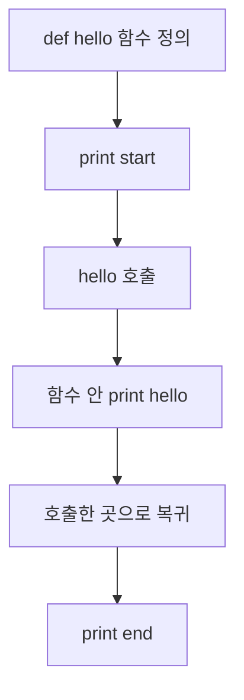

# 4주차 4일차 - 함수, 매개변수, return, 재귀, 스코프, 자료구조

## 오늘의 목표

오늘은 함수 호출 흐름을 읽는 날이다. 정보처리기사 실기에서는 함수가 여러 번 호출되거나, 리스트가 함수로 전달된 뒤 값이 바뀌는 문제가 자주 나온다. 재귀 함수도 짧은 코드로 출제되기 좋아 반드시 손으로 추적할 수 있어야 한다.

- 함수 정의와 호출 순서를 구분할 수 있다.
- 매개변수와 반환값의 흐름을 추적할 수 있다.
- 지역변수와 전역변수를 구분할 수 있다.
- 리스트가 함수에 전달될 때 원본이 바뀌는 경우를 설명할 수 있다.
- 재귀 함수의 호출과 반환을 그림으로 추적할 수 있다.
- 튜플, 딕셔너리, 집합의 기본 동작을 읽을 수 있다.

## 3시간 수업 구성

| 시간 | 내용 |
|---|---|
| 0:00 ~ 0:25 | 함수 정의, 호출, return |
| 0:25 ~ 0:55 | 매개변수와 지역변수 추적 |
| 0:55 ~ 1:20 | 리스트 전달과 원본 변경 |
| 1:20 ~ 1:30 | 쉬는 시간 |
| 1:30 ~ 2:05 | 재귀 함수 호출/반환 추적 |
| 2:05 ~ 2:35 | tuple, dict, set 기본 |
| 2:35 ~ 3:00 | 실기형 종합 문제 |

---

## 1. 함수는 정의만으로 실행되지 않는다

```python
def hello():
    print("hello")

print("start")
hello()
print("end")
```

출력:

```text
start
hello
end
```

실행 흐름:



`def`는 함수를 등록하는 줄이다. 함수 안 코드는 호출될 때 실행된다.

---

## 2. return은 값을 돌려주고 함수를 끝낸다

```python
def add(a, b):
    return a + b

x = add(3, 4)
print(x)
```

호출 흐름:

```text
add(3, 4)
=> a = 3, b = 4
=> return a + b
=> return 7
=> x = 7
```

출력:

```text
7
```

`return` 뒤의 코드는 실행되지 않는다.

```python
def test():
    return 10
    print("after")

print(test())
```

출력:

```text
10
```

---

## 3. 매개변수는 함수 안에서 쓰는 이름이다

```python
def change(x):
    x = x + 5
    print("in", x)

x = 10
change(x)
print("out", x)
```

추적표:

| 위치 | 바깥 x | 함수 안 x | 설명 |
|---|---:|---:|---|
| `x = 10` | 10 | - | 바깥 변수 |
| `change(x)` | 10 | 10 | 값 전달 |
| `x = x + 5` | 10 | 15 | 함수 안 x만 변경 |
| `print("out", x)` | 10 | - | 바깥 x는 그대로 |

출력:

```text
in 15
out 10
```

정수, 문자열 같은 값은 함수 안에서 새로 대입해도 바깥 변수가 바뀌지 않는다.

---

## 4. 리스트는 함수 안에서 원본이 바뀔 수 있다

```python
def change(a):
    a[0] = 9

arr = [1, 2, 3]
change(arr)
print(arr)
```

출력:

```text
[9, 2, 3]
```

그림:

```text
arr ----+
       v
     [1, 2, 3]
       ^
       |
함수 매개변수 a
```

`a[0] = 9`는 같은 리스트 내부 값을 바꾼다.

하지만 아래 코드는 다르다.

```python
def change(a):
    a = [9, 9, 9]

arr = [1, 2, 3]
change(arr)
print(arr)
```

출력:

```text
[1, 2, 3]
```

`a = [9, 9, 9]`는 함수 안의 이름 `a`가 새 리스트를 가리키게 만드는 것이다. 원본 리스트 내부를 바꾼 것이 아니다.

비교:

| 코드 | 원본 변경? | 이유 |
|---|---|---|
| `a[0] = 9` | O | 같은 리스트의 내부 값 변경 |
| `a.append(4)` | O | 같은 리스트에 값 추가 |
| `a = [9, 9, 9]` | X | 함수 안 이름만 새 리스트를 가리킴 |

---

## 5. 지역변수와 전역변수

```python
x = 10

def f():
    x = 20
    print("in", x)

f()
print("out", x)
```

출력:

```text
in 20
out 10
```

함수 안 `x`와 바깥 `x`는 이름은 같아도 다른 변수다.

전역변수를 함수 안에서 바꾸려면 `global`을 쓴다.

```python
x = 10

def f():
    global x
    x = 20

f()
print(x)
```

출력:

```text
20
```

실기에서는 `global`이 보이면 "바깥 변수가 직접 바뀐다"고 표시한다.

---

## 6. 재귀 함수 기본

재귀는 함수가 자기 자신을 호출하는 것이다.

```python
def count(n):
    if n == 0:
        return
    print(n)
    count(n - 1)

count(3)
```

호출 흐름:

```text
count(3)
  print 3
  count(2)
    print 2
    count(1)
      print 1
      count(0)
        return
```

출력:

```text
3
2
1
```

재귀를 읽을 때는 두 가지를 먼저 찾는다.

```text
1. 멈추는 조건: if n == 0
2. 작아지는 값: count(n - 1)
```

---

## 7. 재귀의 반환 추적

```python
def fact(n):
    if n == 1:
        return 1
    return n * fact(n - 1)

print(fact(4))
```

호출이 쌓이는 과정:

```text
fact(4)
=> 4 * fact(3)
=> 4 * (3 * fact(2))
=> 4 * (3 * (2 * fact(1)))
=> 4 * (3 * (2 * 1))
```

반환되는 과정:

```text
fact(1) = 1
fact(2) = 2 * 1 = 2
fact(3) = 3 * 2 = 6
fact(4) = 4 * 6 = 24
```

출력:

```text
24
```

재귀 스택 그림:

```text
위로 쌓임

fact(1) -> 1 반환
fact(2) -> 2 반환
fact(3) -> 6 반환
fact(4) -> 24 반환

아래에서 시작
```

---

## 8. print 위치에 따른 재귀 출력 차이

```python
def f(n):
    if n == 0:
        return
    print(n)
    f(n - 1)

f(3)
```

출력:

```text
3
2
1
```

이번에는 `print`가 재귀 호출 뒤에 있다.

```python
def f(n):
    if n == 0:
        return
    f(n - 1)
    print(n)

f(3)
```

출력:

```text
1
2
3
```

이유:

```text
print가 호출 전이면 내려가며 출력
print가 호출 후이면 돌아오며 출력
```

---

## 9. 튜플

튜플은 변경할 수 없는 순서 있는 묶음이다.

```python
t = (1, 2, 3)
print(t[0])
print(t[1:])
```

출력:

```text
1
(2, 3)
```

튜플은 직접 수정할 수 없다.

```python
t = (1, 2, 3)
# t[0] = 9  # 오류
```

튜플 언패킹:

```python
name, score = ("kim", 80)
print(name)
print(score)
```

출력:

```text
kim
80
```

---

## 10. 딕셔너리

딕셔너리는 key로 value를 찾는 자료구조다.

```python
score = {"kim": 80, "lee": 90}
print(score["kim"])

score["park"] = 70
score["kim"] += 5

print(score)
```

출력:

```text
80
{'kim': 85, 'lee': 90, 'park': 70}
```

구조:

```text
key       value
kim   -> 80
lee   -> 90
```

반복:

```python
score = {"kim": 80, "lee": 90}

for name in score:
    print(name, score[name])
```

출력 순서는 Python 3.7 이상에서는 입력 순서를 유지한다.

```text
kim 80
lee 90
```

---

## 11. 집합

집합은 중복을 제거하고 순서를 중요하게 보지 않는 자료구조다.

```python
a = [1, 2, 2, 3, 3, 3]
b = set(a)
print(b)
```

출력 예:

```text
{1, 2, 3}
```

집합은 출력 순서가 항상 시험 문제의 핵심으로 나오지는 않는다. 중요한 것은 중복 제거다.

집합 연산:

```python
a = {1, 2, 3}
b = {3, 4, 5}

print(a & b)
print(a | b)
print(a - b)
```

의미:

| 연산 | 의미 | 결과 |
|---|---|---|
| `a & b` | 교집합 | `{3}` |
| `a | b` | 합집합 | `{1, 2, 3, 4, 5}` |
| `a - b` | 차집합 | `{1, 2}` |

---

## 12. 실기형 예제 1

```python
def f(a):
    a.append(4)
    a[0] = 9

x = [1, 2, 3]
f(x)
print(x)
```

정답:

```text
[9, 2, 3, 4]
```

`a`와 `x`가 같은 리스트를 가리키므로 내부 변경이 원본에 반영된다.

---

## 13. 실기형 예제 2

```python
def g(n):
    if n <= 1:
        return n
    return g(n - 1) + g(n - 2)

print(g(5))
```

이 함수는 피보나치 형태다.

```text
g(0) = 0
g(1) = 1
g(2) = g(1) + g(0) = 1
g(3) = g(2) + g(1) = 2
g(4) = g(3) + g(2) = 3
g(5) = g(4) + g(3) = 5
```

정답:

```text
5
```

---

## 14. 혼자 푸는 연습문제

### 문제 1

```python
def add(a, b):
    return a + b

print(add(2, 3) * 2)
```

### 문제 2

```python
def change(x):
    x += 10

x = 5
change(x)
print(x)
```

### 문제 3

```python
def change(a):
    a[1] = 7

arr = [1, 2, 3]
change(arr)
print(arr)
```

### 문제 4

```python
def f(n):
    if n == 0:
        return 0
    return n + f(n - 1)

print(f(4))
```

### 문제 5

```python
d = {"A": 1, "B": 2}
d["C"] = d["A"] + d["B"]
d["A"] = 5
print(d["C"])
print(d["A"])
```

### 문제 6

리스트 `["kim:80", "lee:90", "kim:70"]`을 이용해 딕셔너리 `{"kim": 150, "lee": 90}`을 만드는 코드를 작성하시오.

---

## 15. 정답과 해설

### 문제 1 정답

```text
10
```

`add(2, 3)`은 5를 반환하고, 5 * 2 = 10이다.

### 문제 2 정답

```text
5
```

함수 안 `x`만 바뀐다.

### 문제 3 정답

```text
[1, 7, 3]
```

리스트 내부 값이 변경되므로 원본에 반영된다.

### 문제 4 정답

```text
10
```

`4 + 3 + 2 + 1 + 0 = 10`이다.

### 문제 5 정답

```text
3
5
```

`d["C"]`는 처음 계산될 때 1 + 2 = 3으로 저장된다. 이후 `d["A"]`를 5로 바꾸어도 이미 저장된 `d["C"]`가 자동으로 다시 계산되지는 않는다.

### 문제 6 예시 정답

```python
data = ["kim:80", "lee:90", "kim:70"]
result = {}

for item in data:
    name, score = item.split(":")
    score = int(score)

    if name in result:
        result[name] += score
    else:
        result[name] = score

print(result)
```

---

## 오늘의 마무리 체크

- `def`는 함수 정의이고, 호출해야 실행된다.
- `return`은 값을 돌려주고 함수를 종료한다.
- 함수 안에서 정수/문자열 매개변수에 새 값을 대입해도 바깥 변수는 그대로다.
- 리스트 내부를 바꾸면 원본이 바뀔 수 있다.
- 재귀는 멈추는 조건과 작아지는 값을 먼저 찾는다.
- 재귀의 `print` 위치가 호출 전인지 후인지에 따라 출력 순서가 달라진다.
- 딕셔너리는 key로 value를 찾고, 집합은 중복 제거에 자주 쓰인다.
